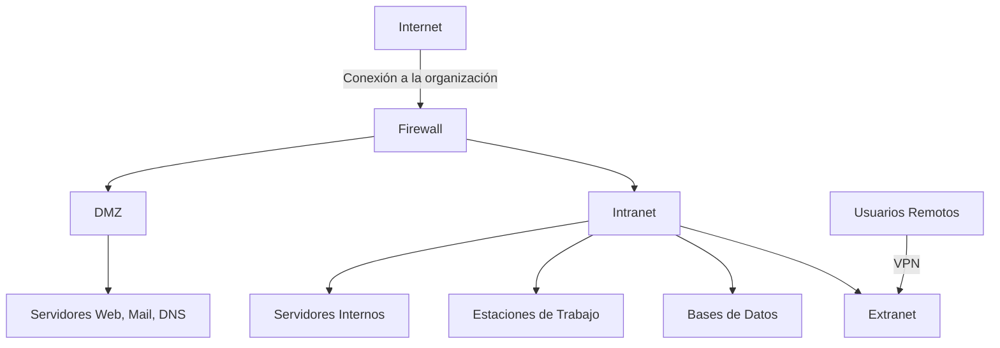
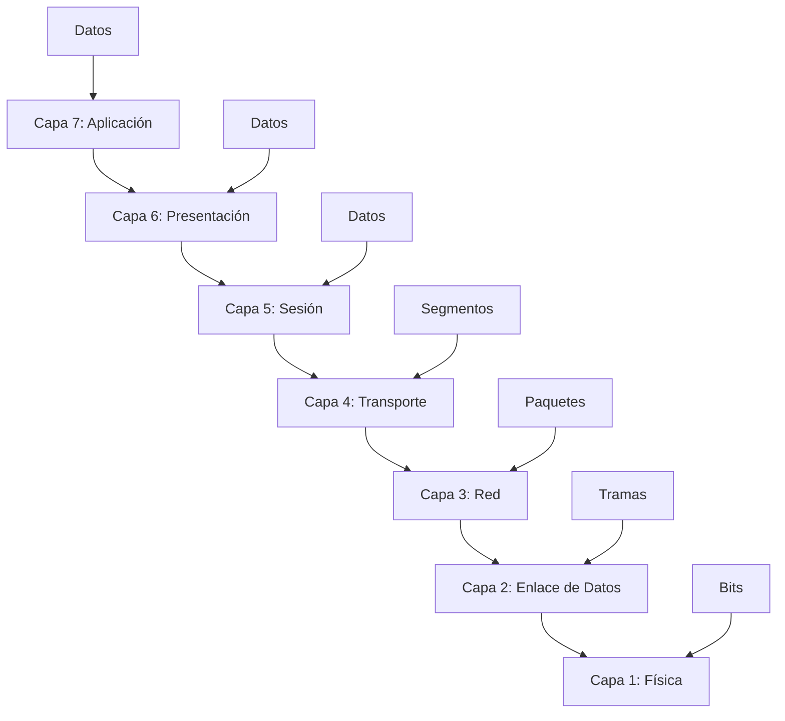
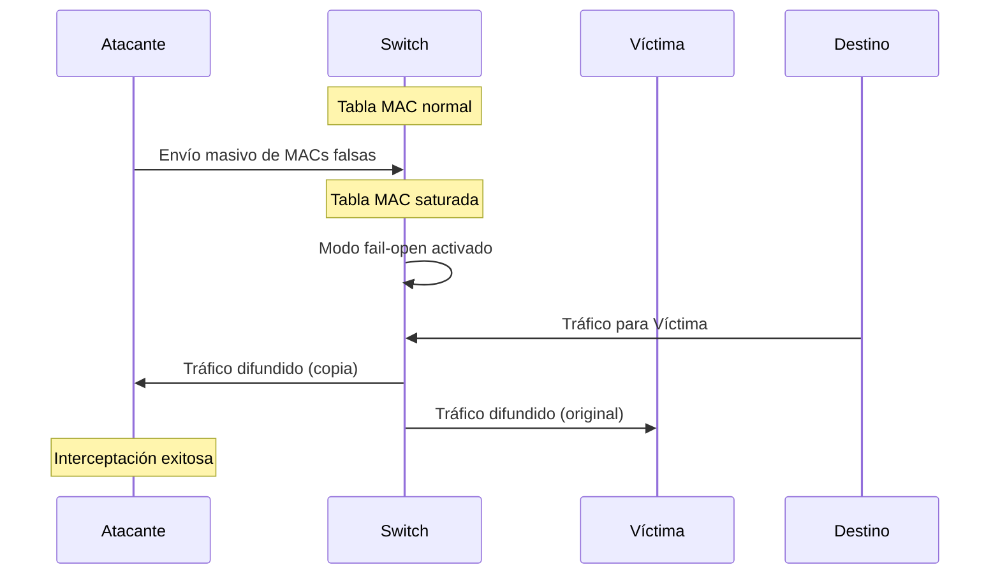
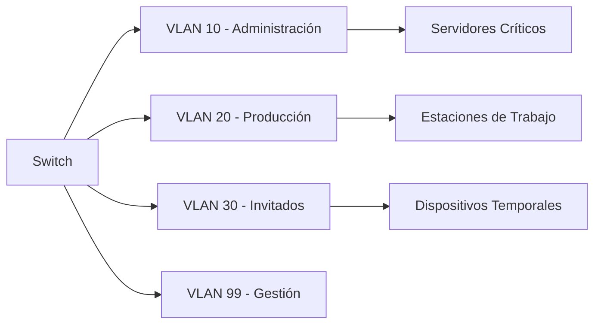

La seguridad en redes representa uno de los pilares fundamentales en la infraestructura tecnológica moderna. Este análisis examina los conceptos esenciales de arquitecturas de red, el modelo OSI como marco de referencia para la comunicación, y los vectores de ataque más relevantes en entornos empresariales, con especial énfasis en los ataques de inundación MAC. La comprensión integral de estos elementos permite a los profesionales de seguridad desarrollar estrategias de defensa efectivas y diseñar infraestructuras resilientes ante amenazas contemporáneas.

## Arquitecturas de Red Empresariales

### Clasificación de Redes por Alcance y Propósito

Las organizaciones modernas implementan diferentes tipos de redes según sus necesidades operativas y requerimientos de seguridad. Esta segmentación permite optimizar el rendimiento, controlar el acceso y minimizar la superficie de ataque[^1][^5].

#### Intranet: La Red Corporativa Interna

Una **intranet** constituye una red informática privada que utiliza tecnologías del protocolo de Internet para compartir información, sistemas operativos y servicios de computación exclusivamente dentro de una organización[^5][^11]. Esta red interna emplea los mismos estándares técnicos que Internet, pero su acceso está restringido únicamente a los miembros autorizados de la organización[^15][^18].

Las características principales de una intranet incluyen[^11][^20]:

- **Seguridad perimetral**: Implementación de firewalls y sistemas de autenticación para controlar el acceso
- **Gestión centralizada**: Administración unificada de recursos, aplicaciones y datos corporativos
- **Protocolo estándar**: Utilización de TCP/IP para garantizar interoperabilidad
- **Acceso remoto**: Posibilidad de conexión externa mediante VPN (Virtual Private Network)



#### DMZ: Zona Desmilitarizada

La **DMZ (Demilitarized Zone)** representa un segmento de red especialmente diseñado para alojar servicios públicamente accesibles mientras mantiene aislada la red interna corporativa[^1][^6]. Esta arquitectura de seguridad posiciona servidores críticos en una subred intermedia entre la red externa no confiable (Internet) y la red interna protegida.

Los servicios típicamente ubicados en la DMZ incluyen[^6]:


| Servicio | Propósito | Riesgo de Exposición |
| :-- | :-- | :-- |
| Servidor Web | Hosting de aplicaciones públicas | Alto |
| Servidor de Correo | Gestión de comunicaciones externas | Medio |
| Servidor DNS | Resolución de nombres de dominio | Medio |
| Servidor FTP | Transferencia de archivos | Alto |
| Proxy/Load Balancer | Distribución de carga y filtrado | Medio |

#### Extranet: Extensión Controlada para Terceros

Una **extranet** constituye una red privada que extiende selectivamente el acceso a recursos corporativos hacia socios comerciales, proveedores y clientes autorizados[^7][^12]. Esta arquitectura permite la colaboración externa manteniendo controles de seguridad estrictos sobre la información compartida.

Los beneficios empresariales de implementar una extranet incluyen[^7]:

- **Reducción de costos operativos**: Automatización de procesos de intercambio de información
- **Mejora en la eficiencia**: Acceso directo a datos relevantes para socios externos
- **Seguridad transaccional**: Cifrado y autenticación en todas las comunicaciones
- **Control granular**: Administración detallada de permisos y accesos


## Modelo OSI: Marco de Referencia para Comunicaciones de Red

### Estructura Jerárquica del Modelo OSI

El **modelo OSI (Open Systems Interconnection)** constituye un marco conceptual desarrollado por la Organización Internacional para la Estandarización que define cómo se comunican los sistemas de red mediante siete capas interconectadas[^2][^9][^14]. Este modelo proporciona un lenguaje universal para las comunicaciones de red, permitiendo que tecnologías diversas interoperen mediante protocolos estandarizados.




### Descripción Detallada de las Capas OSI

La siguiente tabla presenta una descripción comprehensiva de cada capa del modelo OSI[^17][^19][^21]:


| Capa | Nombre | PDU | Función Principal | Protocolos Ejemplo |
| :-- | :-- | :-- | :-- | :-- |
| 7 | Aplicación | Datos | APIs de alto nivel, servicios de red | HTTP, FTP, SMTP, DNS |
| 6 | Presentación | Datos | Codificación, compresión y cifrado | SSL/TLS, JPEG, MPEG |
| 5 | Sesión | Datos | Establecimiento y gestión de sesiones | NetBIOS, RPC, SQL |
| 4 | Transporte | Segmentos | Transmisión confiable extremo a extremo | TCP, UDP |
| 3 | Red | Paquetes | Enrutamiento y direccionamiento lógico | IP, ICMP, OSPF |
| 2 | Enlace de Datos | Tramas | Control de acceso al medio y detección de errores | Ethernet, Wi-Fi, PPP |
| 1 | Física | Bits | Transmisión de señales eléctricas/ópticas | Cable UTP, fibra óptica |

### Unidades de Datos de Protocolo (PDU)

Las **PDU (Protocol Data Units)** representan las unidades de información intercambiadas entre capas equivalentes en diferentes sistemas[^4][^17]. Cada capa encapsula los datos recibidos de la capa superior agregando su propia información de control, creando una estructura jerárquica de encapsulación:

- **N-SDU (Service Data Unit)**: Datos requeridos por las entidades para realizar funciones de servicio
- **N-PCI (Protocol Control Information)**: Información de control intercambiada entre entidades pares
- **N-PDU**: Combinación de N-SDU + N-PCI transmitida entre capas equivalentes


## Vectores de Ataque en Capa 2: MAC Flooding

### Fundamentos del Ataque MAC Flooding

El **MAC flooding** constituye un ataque de capa 2 que explota las limitaciones de memoria de los switches de red para comprometer la seguridad del tráfico[^1][^8][^13]. Este ataque aprovecha el mecanismo de aprendizaje de direcciones MAC de los switches para forzar un comportamiento de difusión que expone tráfico sensible.

#### Mecánica del Ataque

El proceso de ataque MAC flooding sigue la siguiente secuencia[^13][^16]:

1. **Generación masiva de tramas**: El atacante envía miles de tramas Ethernet con direcciones MAC de origen falsificadas
2. **Saturación de la tabla CAM**: La tabla de direcciones MAC del switch se llena hasta su capacidad máxima
3. **Modo fail-open**: El switch comienza a funcionar como un hub, difundiendo todo el tráfico a todos los puertos
4. **Interceptación de datos**: El atacante puede capturar tráfico destinado a otros dispositivos



#### Ejemplo Práctico con Herramienta macof

La herramienta **macof** permite ejecutar ataques MAC flooding de manera automatizada[^1]. El siguiente comando ilustra su uso:

```bash
sudo macof -i eth0
```

Este comando genera miles de direcciones MAC aleatorias y las envía a través de la interfaz especificada, saturando rápidamente la tabla MAC del switch objetivo.

### Tabla MAC: Estado Normal vs. Comprometido

El siguiente análisis compara el estado de una tabla MAC antes y después del ataque[^1]:

**Estado Normal:**

```
R01#show mac-address-table
Address Table:
Destination Address    Address Type    VLAN    Destination Port
50eb.f63f.3024        Dynamic         1       FastEthernet1
00da.5504.8105        Dynamic         1       FastEthernet1
a80c.0da0.e600        Self            1       Vlan1
0860.6e07.a4df        Dynamic         1       FastEthernet1
0800.27c7.e136        Dynamic         1       FastEthernet1
```

**Estado Comprometido (post-ataque):**

```
R01#show mac-address-table
Address Table:
Destination Address    Address Type    VLAN    Destination Port
78f7.3766.bc44        Dynamic         1       FastEthernet1
1219.0915.c2f7        Dynamic         1       FastEthernet1
840a.6f1c.92a6        Dynamic         1       FastEthernet1
[... miles de entradas adicionales ...]
```


### Riesgos y Consecuencias del MAC Flooding

Los ataques MAC flooding pueden ocasionar múltiples impactos negativos en la infraestructura de red[^13]:


| Tipo de Impacto | Descripción | Gravedad |
| :-- | :-- | :-- |
| **Exposición de Datos** | Interceptación de tráfico confidencial | Crítica |
| **Denegación de Servicio** | Degradación del rendimiento de red | Alta |
| **Acceso No Autorizado** | Captura de credenciales y datos sensibles | Crítica |
| **Ataques Secundarios** | Base para ataques MITM y ARP spoofing | Alta |

## Dispositivos de Red y Seguridad

### Clasificación de Dispositivos de Red

Los dispositivos de red se categorizan según sus funcionalidades y el nivel OSI en el que operan[^1]:

#### Dispositivos de Conectividad

| Dispositivo | Capa OSI | Función Principal | Características |
| :-- | :-- | :-- | :-- |
| **Router** | 3 (Red) | Enrutamiento entre redes IP | Tabla de enrutamiento, protocolos dinámicos |
| **L2 Switch** | 2 (Enlace) | Conmutación basada en MAC | Tabla MAC, VLANs, STP |
| **L3 Switch** | 2-3 | Conmutación + enrutamiento | Combinación de funcionalidades L2/L3 |
| **Access Point** | 1-2 | Conectividad inalámbrica | 802.11, autenticación WiFi |

#### Dispositivos de Seguridad

| Dispositivo | Funcionalidad | Capacidades de Protección |
| :-- | :-- | :-- |
| **Firewall** | Filtrado de tráfico | Reglas ACL, inspección de estado |
| **IPS (Intrusion Prevention System)** | Prevención activa | Bloqueo automático, análisis de firmas |
| **IDS (Intrusion Detection System)** | Detección pasiva | Alertas, análisis de comportamiento |
| **UTM (Unified Threat Management)** | Seguridad integrada | Firewall + Antivirus + IPS + Filtrado |

### Medidas Preventivas Contra MAC Flooding

#### Configuración de Seguridad de Puertos

La implementación de **port security** representa la medida más efectiva contra ataques MAC flooding[^8][^13]:

```cisco
Switch(config)# interface fastethernet 0/1
Switch(config-if)# switchport mode access
Switch(config-if)# switchport port-security
Switch(config-if)# switchport port-security maximum 2
Switch(config-if)# switchport port-security mac-address sticky
Switch(config-if)# switchport port-security violation shutdown
```


#### Segmentación mediante VLANs

La implementación de VLANs limita el alcance de los ataques MAC flooding[^13]:




#### Técnicas de Monitoreo y Detección

Las siguientes herramientas permiten detectar ataques MAC flooding en tiempo real[^13]:

- **Wireshark**: Análisis de tráfico para detectar patrones anómalos
- **SNMP Monitoring**: Supervisión de contadores de tabla MAC
- **Syslog Analysis**: Análisis de logs de switches para eventos de seguridad
- **Network Behavioral Analysis**: Detección de anomalías en patrones de tráfico


## Conclusiones

La seguridad en redes empresariales requiere una comprensión integral de las arquitecturas de red, los protocolos de comunicación y los vectores de ataque contemporáneos. El modelo OSI proporciona el marco conceptual necesario para entender las interacciones entre diferentes tecnologías de red, mientras que la implementación adecuada de arquitecturas segmentadas (Intranet, DMZ, Extranet) establece las bases para una defensa efectiva.

Los ataques de capa 2, ejemplificados por el MAC flooding, demuestran la importancia de implementar controles de seguridad específicos en cada nivel de la infraestructura de red. La configuración apropiada de dispositivos de red, combinada con técnicas de monitoreo continuo y segmentación mediante VLANs, proporciona múltiples capas de defensa contra estas amenazas.

La evolución constante del panorama de amenazas requiere que los profesionales de seguridad mantengan un enfoque proactivo en la implementación de medidas preventivas y la actualización continua de sus conocimientos técnicos. La integración de dispositivos de seguridad especializados (IPS, IDS, UTM) con configuraciones de red adecuadas establece un perímetro de defensa robusto capaz de resistir ataques sofisticados y proteger los activos críticos de la organización.

## Referencias

[^1]: <a href="https://thexssrat.podia.com/view/courses/core-networking-concepts-for-ethical-hackers-beginners/1935594-introduction/6149427-lesson-1-introduction-to-networking-concepts-pdf" target="_blank" rel="noopener">https://thexssrat.podia.com/view/courses/core-networking-concepts-for-ethical-hackers-beginners/1935594-introduction/6149427-lesson-1-introduction-to-networking-concepts-pdf</a>

[^2]: <a href="https://www.proofpoint.com/es/threat-reference/osi-model" target="_blank" rel="noopener">https://www.proofpoint.com/es/threat-reference/osi-model</a>

[^3]: <a href="https://www.ionos.com/es-us/digitalguide/servidores/know-how/capa-fisica/" target="_blank" rel="noopener">https://www.ionos.com/es-us/digitalguide/servidores/know-how/capa-fisica/</a>

[^4]: <a href="https://es.wikipedia.org/wiki/Unidad_de_datos_de_protocolo" target="_blank" rel="noopener">https://es.wikipedia.org/wiki/Unidad_de_datos_de_protocolo</a>

[^5]: <a href="https://es.wikipedia.org/wiki/Intranet" target="_blank" rel="noopener">https://es.wikipedia.org/wiki/Intranet</a>

[^6]: <a href="https://www.checkpoint.com/es/cyber-hub/network-security/what-is-a-dmz-network/" target="_blank" rel="noopener">https://www.checkpoint.com/es/cyber-hub/network-security/what-is-a-dmz-network/</a>

[^7]: <a href="https://www.ciset.es/glosario/440-extranet" target="_blank" rel="noopener">https://www.ciset.es/glosario/440-extranet</a>

[^8]: <a href="https://alexhost.com/es/faq/que-es-el-mac-flooding-como-evitarlo/" target="_blank" rel="noopener">https://alexhost.com/es/faq/que-es-el-mac-flooding-como-evitarlo/</a>

[^9]: <a href="https://www.cloudflare.com/es-es/learning/ddos/glossary/open-systems-interconnection-model-osi/" target="_blank" rel="noopener">https://www.cloudflare.com/es-es/learning/ddos/glossary/open-systems-interconnection-model-osi/</a>

[^10]: <a href="https://www.azion.com/es/learning/network-layer/que-es-la-capa-de-red/" target="_blank" rel="noopener">https://www.azion.com/es/learning/network-layer/que-es-la-capa-de-red/</a>

[^11]: <a href="https://www.servnet.mx/blog/intranet-que-es-como-funciona-y-cuando-es-recomendable" target="_blank" rel="noopener">https://www.servnet.mx/blog/intranet-que-es-como-funciona-y-cuando-es-recomendable</a>

[^12]: <a href="https://www.ionos.mx/startupguide/productividad/extranet/" target="_blank" rel="noopener">https://www.ionos.mx/startupguide/productividad/extranet/</a>

[^13]: <a href="https://jumpcloud.com/it-index/what-is-a-mac-flooding-attack" target="_blank" rel="noopener">https://jumpcloud.com/it-index/what-is-a-mac-flooding-attack</a>

[^14]: <a href="https://aws.amazon.com/es/what-is/osi-model/" target="_blank" rel="noopener">https://aws.amazon.com/es/what-is/osi-model/</a>

[^15]: <a href="https://www.arimetrics.com/glosario-digital/intranet" target="_blank" rel="noopener">https://www.arimetrics.com/glosario-digital/intranet</a>

[^16]: <a href="https://en.wikipedia.org/wiki/MAC_flooding" target="_blank" rel="noopener">https://en.wikipedia.org/wiki/MAC_flooding</a>

[^17]: <a href="https://es.wikipedia.org/wiki/Modelo_OSI" target="_blank" rel="noopener">https://es.wikipedia.org/wiki/Modelo_OSI</a>

[^18]: <a href="https://www.ciset.es/glosario/455-intranet" target="_blank" rel="noopener">https://www.ciset.es/glosario/455-intranet</a>

[^19]: <a href="https://es.linkedin.com/pulse/un-análisis-profundo-de-las-7-capas-red-del-modelo-osi-canaveri-exdhf" target="_blank" rel="noopener">https://es.linkedin.com/pulse/un-análisis-profundo-de-las-7-capas-red-del-modelo-osi-canaveri-exdhf</a>

[^20]: <a href="https://www.ionos.es/startupguide/productividad/intranet-las-ventajas-de-una-red-interna-segura/" target="_blank" rel="noopener">https://www.ionos.es/startupguide/productividad/intranet-las-ventajas-de-una-red-interna-segura/</a>

[^21]: <a href="https://telecapp.com/modelo-osi" target="_blank" rel="noopener">https://telecapp.com/modelo-osi</a>

[^22]: <a href="https://www.semanticscholar.org/paper/b92e3e6b7ba2038e1fea8f9f305dd0e47a7b9739" target="_blank" rel="noopener">https://www.semanticscholar.org/paper/b92e3e6b7ba2038e1fea8f9f305dd0e47a7b9739</a>

[^23]: <a href="https://www.semanticscholar.org/paper/44a126a83d160247ff750d7f0618a0e5991d78ff" target="_blank" rel="noopener">https://www.semanticscholar.org/paper/44a126a83d160247ff750d7f0618a0e5991d78ff</a>

[^24]: <a href="https://www.semanticscholar.org/paper/144c49c36d9fa4306883d4532e0c3fe6d2419f23" target="_blank" rel="noopener">https://www.semanticscholar.org/paper/144c49c36d9fa4306883d4532e0c3fe6d2419f23</a>

[^25]: <a href="https://www.semanticscholar.org/paper/ae909864c00846aa73174577233423cdb86e451b" target="_blank" rel="noopener">https://www.semanticscholar.org/paper/ae909864c00846aa73174577233423cdb86e451b</a>

[^26]: <a href="https://www.semanticscholar.org/paper/eb78b8946aebe52737eea0d1390a065e947c83b3" target="_blank" rel="noopener">https://www.semanticscholar.org/paper/eb78b8946aebe52737eea0d1390a065e947c83b3</a>

[^27]: <a href="https://www.semanticscholar.org/paper/e94e93e517b830d983e6b1ba7e6f00a5d07afb35" target="_blank" rel="noopener">https://www.semanticscholar.org/paper/e94e93e517b830d983e6b1ba7e6f00a5d07afb35</a>

[^28]: <a href="https://www.semanticscholar.org/paper/f86115f8569d63faa4853e56f01a33bf1852257e" target="_blank" rel="noopener">https://www.semanticscholar.org/paper/f86115f8569d63faa4853e56f01a33bf1852257e</a>

[^29]: <a href="https://www.semanticscholar.org/paper/ee998396921449a71f0e659dcaa4134efdf44624" target="_blank" rel="noopener">https://www.semanticscholar.org/paper/ee998396921449a71f0e659dcaa4134efdf44624</a>

[^30]: <a href="https://www.semanticscholar.org/paper/a18a91350c3f8801cdba1444b959aaa8f432b474" target="_blank" rel="noopener">https://www.semanticscholar.org/paper/a18a91350c3f8801cdba1444b959aaa8f432b474</a>

[^31]: <a href="https://www.semanticscholar.org/paper/232542d3e979fb08deba344c7988cc38b0ed9c1f" target="_blank" rel="noopener">https://www.semanticscholar.org/paper/232542d3e979fb08deba344c7988cc38b0ed9c1f</a>

[^32]: <a href="https://www.datasunrise.com/es/centro-de-conocimiento/modelo-osi/" target="_blank" rel="noopener">https://www.datasunrise.com/es/centro-de-conocimiento/modelo-osi/</a>

[^33]: <a href="https://users.exa.unicen.edu.ar/catedras/comdat1/material/ElmodeloOSI.pdf" target="_blank" rel="noopener">https://users.exa.unicen.edu.ar/catedras/comdat1/material/ElmodeloOSI.pdf</a>

[^34]: <a href="https://docs.oracle.com/cd/E19957-01/820-2981/6nei0r0r9/index.html" target="_blank" rel="noopener">https://docs.oracle.com/cd/E19957-01/820-2981/6nei0r0r9/index.html</a>

[^35]: <a href="https://tododeredes.com/modelo-osi/capa-2/" target="_blank" rel="noopener">https://tododeredes.com/modelo-osi/capa-2/</a>

[^36]: <a href="https://www.semanticscholar.org/paper/b0fa83d224719843a262f41c1901dbd0119955a3" target="_blank" rel="noopener">https://www.semanticscholar.org/paper/b0fa83d224719843a262f41c1901dbd0119955a3</a>

[^37]: <a href="https://www.semanticscholar.org/paper/bc34e934a9d88daa853ca37fbff9cee31da75702" target="_blank" rel="noopener">https://www.semanticscholar.org/paper/bc34e934a9d88daa853ca37fbff9cee31da75702</a>

[^38]: <a href="https://www.semanticscholar.org/paper/48bfc6d7fb5965f9c2185b0cc6bc8308488dffcd" target="_blank" rel="noopener">https://www.semanticscholar.org/paper/48bfc6d7fb5965f9c2185b0cc6bc8308488dffcd</a>

[^39]: <a href="https://www.semanticscholar.org/paper/8152dd6d3b06807a41a760b9ccae06f3a2242399" target="_blank" rel="noopener">https://www.semanticscholar.org/paper/8152dd6d3b06807a41a760b9ccae06f3a2242399</a>

[^40]: <a href="https://www.semanticscholar.org/paper/1489c9f70d91721327ba42117f9536e2c98664df" target="_blank" rel="noopener">https://www.semanticscholar.org/paper/1489c9f70d91721327ba42117f9536e2c98664df</a>

[^41]: <a href="https://www.semanticscholar.org/paper/f7ddc6912b4067f799bc6550ed7b4ef6cb8c3011" target="_blank" rel="noopener">https://www.semanticscholar.org/paper/f7ddc6912b4067f799bc6550ed7b4ef6cb8c3011</a>

[^42]: <a href="https://www.semanticscholar.org/paper/5d847a2d83a4c8db5d51d58cbdf9f7bcf5c0859f" target="_blank" rel="noopener">https://www.semanticscholar.org/paper/5d847a2d83a4c8db5d51d58cbdf9f7bcf5c0859f</a>

[^43]: <a href="https://www.semanticscholar.org/paper/d817d4c17bdd28593a551fd2cc8a5531ef19b9a1" target="_blank" rel="noopener">https://www.semanticscholar.org/paper/d817d4c17bdd28593a551fd2cc8a5531ef19b9a1</a>

[^44]: <a href="https://www.semanticscholar.org/paper/b53fce6a542fe147e025b28dc5a9a1b5b99084e3" target="_blank" rel="noopener">https://www.semanticscholar.org/paper/b53fce6a542fe147e025b28dc5a9a1b5b99084e3</a>

[^45]: <a href="https://www.semanticscholar.org/paper/474a2d4f7dca7ee585d1a1bbc4a884e649368963" target="_blank" rel="noopener">https://www.semanticscholar.org/paper/474a2d4f7dca7ee585d1a1bbc4a884e649368963</a>

[^46]: <a href="https://www.innovaportal.com/innovaportal/v/75/1/innova.front/que-es-una-intranet" target="_blank" rel="noopener">https://www.innovaportal.com/innovaportal/v/75/1/innova.front/que-es-una-intranet</a>

[^47]: <a href="https://es.barracuda.com/support/glossary/dmz-network" target="_blank" rel="noopener">https://es.barracuda.com/support/glossary/dmz-network</a>

[^48]: <a href="https://www.semanticscholar.org/paper/53ba8cf1dd495b659fce7823f93815c673d63bad" target="_blank" rel="noopener">https://www.semanticscholar.org/paper/53ba8cf1dd495b659fce7823f93815c673d63bad</a>

[^49]: <a href="https://www.semanticscholar.org/paper/f5b9dfdf84778a73cc92a93975219cffbae5b05f" target="_blank" rel="noopener">https://www.semanticscholar.org/paper/f5b9dfdf84778a73cc92a93975219cffbae5b05f</a>

[^50]: <a href="https://www.semanticscholar.org/paper/e63d9ae54f13a828ba53e6d60791177bbf1ccc33" target="_blank" rel="noopener">https://www.semanticscholar.org/paper/e63d9ae54f13a828ba53e6d60791177bbf1ccc33</a>

[^51]: <a href="https://www.semanticscholar.org/paper/62a315801874f59a75b5d453e2b2b909ffbf6bcd" target="_blank" rel="noopener">https://www.semanticscholar.org/paper/62a315801874f59a75b5d453e2b2b909ffbf6bcd</a>

[^52]: <a href="https://www.semanticscholar.org/paper/c9927f7758cb2c1160b478969eee05f0e930c7e4" target="_blank" rel="noopener">https://www.semanticscholar.org/paper/c9927f7758cb2c1160b478969eee05f0e930c7e4</a>

[^53]: <a href="https://www.semanticscholar.org/paper/bc695d4173bafc69057f34225ca20b96f4a27e68" target="_blank" rel="noopener">https://www.semanticscholar.org/paper/bc695d4173bafc69057f34225ca20b96f4a27e68</a>

[^54]: <a href="https://www.semanticscholar.org/paper/a165b85a6c636720cddc074c2d3cee4db48c382a" target="_blank" rel="noopener">https://www.semanticscholar.org/paper/a165b85a6c636720cddc074c2d3cee4db48c382a</a>

[^55]: <a href="https://www.semanticscholar.org/paper/7f3bccd71932dfb41286c5405c6b30bdeffa983b" target="_blank" rel="noopener">https://www.semanticscholar.org/paper/7f3bccd71932dfb41286c5405c6b30bdeffa983b</a>

[^56]: <a href="https://www.semanticscholar.org/paper/cac87a13032d1f0339eb6c1aafb92ce67b97e6e5" target="_blank" rel="noopener">https://www.semanticscholar.org/paper/cac87a13032d1f0339eb6c1aafb92ce67b97e6e5</a>

[^57]: <a href="https://www.semanticscholar.org/paper/65cb422f7465ddd0116a6a1ac050c937ccd60457" target="_blank" rel="noopener">https://www.semanticscholar.org/paper/65cb422f7465ddd0116a6a1ac050c937ccd60457</a>

[^58]: <a href="https://pt.wikipedia.org/wiki/Mac_flooding" target="_blank" rel="noopener">https://pt.wikipedia.org/wiki/Mac_flooding</a>

[^59]: <a href="https://www.dltec.com.br/blog/redes/mac-flooding-transformando-um-switch-em-um-hub/" target="_blank" rel="noopener">https://www.dltec.com.br/blog/redes/mac-flooding-transformando-um-switch-em-um-hub/</a>

[^60]: <a href="https://community.cisco.com/t5/artigos-segurança/como-proteger-sua-rede-contra-o-ataque-mac-address-flooding/ta-p/5079591" target="_blank" rel="noopener">https://community.cisco.com/t5/artigos-segurança/como-proteger-sua-rede-contra-o-ataque-mac-address-flooding/ta-p/5079591</a>

[^61]: <a href="https://www.cyberseguridad.net/mac-flooding-ataques-informaticos-vii" target="_blank" rel="noopener">https://www.cyberseguridad.net/mac-flooding-ataques-informaticos-vii</a>

[^62]: <a href="https://msmk.university/que-es-el-dmz-msmk-university/" target="_blank" rel="noopener">https://msmk.university/que-es-el-dmz-msmk-university/</a>

[^63]: <a href="https://es.wikipedia.org/wiki/Extranet" target="_blank" rel="noopener">https://es.wikipedia.org/wiki/Extranet</a>

[^64]: <a href="https://davidlaghezza.home.blog/2019/01/21/inundacion-de-mac-con-macof/" target="_blank" rel="noopener">https://davidlaghezza.home.blog/2019/01/21/inundacion-de-mac-con-macof/</a>

[^65]: <a href="https://www.scribd.com/document/583220528/Mac-Flooding" target="_blank" rel="noopener">https://www.scribd.com/document/583220528/Mac-Flooding</a>

[^66]: <a href="https://es.linkedin.com/learning/ciberseguridad-practica-redes-y-web/ataque-mac-flooding" target="_blank" rel="noopener">https://es.linkedin.com/learning/ciberseguridad-practica-redes-y-web/ataque-mac-flooding</a>
