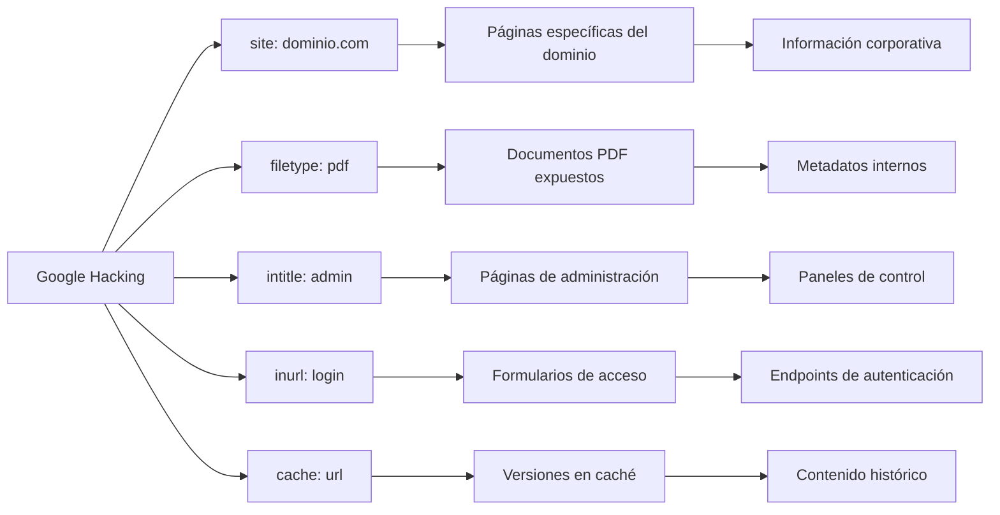
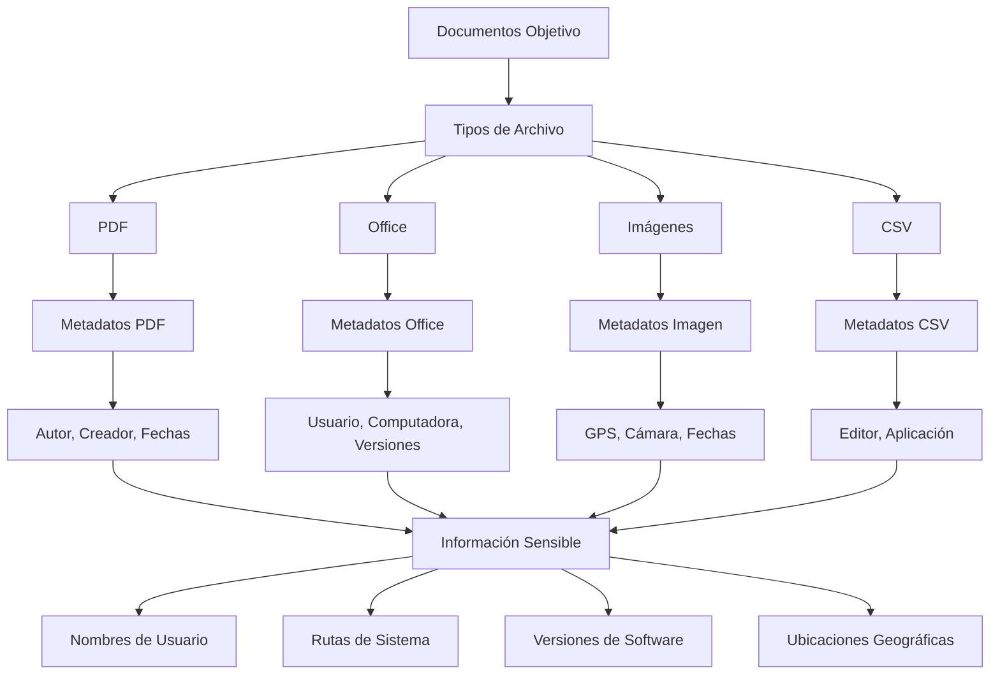
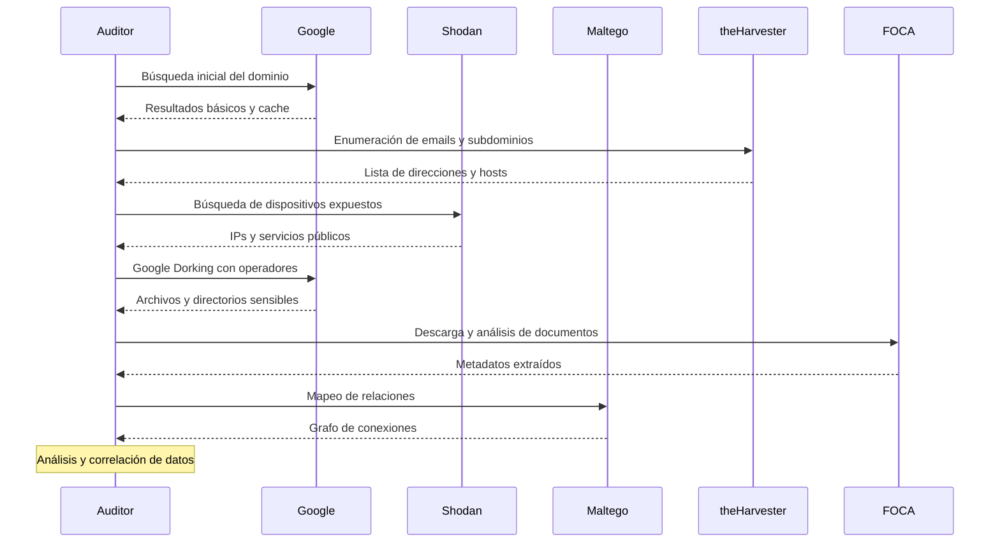

La recolección de información pasiva constituye el fundamento de cualquier auditoría de seguridad informática exitosa, representando el primer paso crítico en las metodologías de pentesting reconocidas internacionalmente. Este proceso, que implica la obtención de inteligencia sobre el objetivo sin establecer contacto directo con sus sistemas, permite a los profesionales de seguridad desarrollar un entendimiento profundo de la infraestructura, procesos y posibles vectores de ataque antes de proceder a fases más intrusivas. La eficacia de esta etapa determina en gran medida el éxito de todo el proceso de evaluación de seguridad, proporcionando el contexto necesario para tomar decisiones informadas y minimizar los riesgos durante las pruebas posteriores.

## Fundamentos de la Recolección de Información Pasiva

La recolección de información pasiva, también conocida como reconocimiento pasivo, se define como el proceso de recopilación de datos sobre un objetivo sin establecer una conexión directa entre el auditor y los sistemas del cliente[^5][^8]. Esta metodología se distingue fundamentalmente de las técnicas activas porque no genera tráfico hacia la infraestructura del objetivo, evitando así la activación de sistemas de detección como firewalls, IDS (Sistemas de Detección de Intrusos) o SIEM (Security Information and Event Management)[^1].

El concepto de inteligencia de fuentes abiertas (OSINT, por sus siglas en inglés) constituye el núcleo de esta disciplina. OSINT se define como la extracción de inteligencia de alto valor mediante la recopilación de registros de fuentes abiertas para crear un perfil integral de objetivos específicos[^8][^9]. Esta información puede incluir desde direcciones de correo electrónico y subdominios hasta detalles técnicos sobre la infraestructura y datos personales de empleados que pueden ser utilizados posteriormente en ataques de ingeniería social[^15].

## La Importancia Estratégica en el Pentesting

La fase de recolección de información pasiva adquiere una importancia fundamental que va más allá de la simple obtención de datos técnicos. Como enfatiza el Penetration Testing Execution Standard (PTES), esta etapa permite a los auditores comprender no solo la infraestructura tecnológica, sino también el contexto empresarial y operacional del objetivo[^29][^30]. Esta comprensión integral es esencial porque diferentes sectores industriales tienen distintos niveles de tolerancia al riesgo y impactos operacionales[^1].

Por ejemplo, una empresa que se dedica a la fabricación de productos básicos puede tolerar una desconexión temporal de internet sin mayores consecuencias financieras. Sin embargo, una firma que opera en mercados financieros podría experimentar pérdidas millonarias por una interrupción de apenas diez minutos en sus sistemas de trading[^1]. Esta diferenciación sectorial influye directamente en la planificación y ejecución de las pruebas de penetración, determinando qué vulnerabilidades representan riesgos críticos y cuáles pueden considerarse de menor prioridad.

La metodología PTES establece que aproximadamente el 30% del tiempo total del proyecto debería dedicarse a la recolección de información[^1]. Esta inversión temporal se justifica porque una recolección exhaustiva proporciona múltiples vectores de ataque alternativos, evitando el temido escenario de "callejón sin salida" donde el auditor no encuentra vulnerabilidades explotables[^1]. La documentación adecuada de todos los hallazgos, incluso los negativos, resulta crucial para demostrar el valor del trabajo realizado y proporcionar una evaluación completa de la postura de seguridad del cliente[^1].

## Técnicas Fundamentales de OSINT

### Google Hacking y Búsquedas Avanzadas

El Google Hacking, también conocido como Google Dorking, representa una de las técnicas más poderosas para la recolección de información pasiva[^11][^18]. Esta metodología utiliza operadores de búsqueda especializados para localizar información sensible que las organizaciones han expuesto inadvertidamente en internet. Los operadores fundamentales incluyen `site:`, `intitle:`, `inurl:`, `filetype:` y `cache:`[^18].

La técnica aprovecha el hecho de que muchas aplicaciones web incluyen información sobre sus versiones en cada página que sirven, como "Powered by XOOPS 2.2.3 Final", que puede utilizarse para buscar sitios web que ejecutan versiones vulnerables[^11]. Por ejemplo, una consulta como `intitle:admbook intitle:Fversion filetype:php` localizaría páginas PHP con las cadenas "admbook" y "Fversion" en sus títulos, indicando el uso de Admbook, una aplicación con vulnerabilidades conocidas de inyección de código[^11].

### Herramientas Especializadas de Recolección

**theHarvester** se posiciona como una de las herramientas más utilizadas para la recolección automatizada de información[^15][^16]. Esta herramienta OSINT permite recopilar direcciones de correo electrónico, subdominios, hosts virtuales, puertos abiertos, banners y nombres de empleados de una organización desde diferentes fuentes públicas como motores de búsqueda, servidores de claves PGP, direcciones IP y URLs[^15][^16].

La sintaxis básica de theHarvester es `theHarvester -d dominio.com -b fuente`, donde las fuentes pueden incluir Google, Bing, Yahoo, Shodan, y muchas otras[^15]. La herramienta también permite configurar claves API para servicios como Hunter.io, lo que mejora significativamente la calidad y cantidad de resultados obtenidos[^15].

**Shodan**, conocido como "el Google para hackers", permite encontrar dispositivos conectados a internet como servidores, routers y cámaras web[^9][^10]. Esta plataforma escanea internet en busca de dispositivos expuestos, proporcionando información valiosa sobre la red de una organización y ayudando a identificar sistemas sin parches o puntos débiles[^9].

**Maltego** sobresale como una de las herramientas OSINT más poderosas, permitiendo a los usuarios mapear visualmente las conexiones entre varios puntos de datos[^9][^10]. Facilita la identificación de relaciones entre entidades como personas, organizaciones y sitios web, siendo especialmente útil para el análisis de redes, rastreo de entidades en línea y descubrimiento de enlaces ocultos dentro de grandes conjuntos de datos[^9].

## Extracción y Análisis de Metadatos

La extracción de metadatos constituye una técnica fundamental que revela información que las organizaciones frecuentemente exponen sin darse cuenta[^12][^17]. Los metadatos pueden incluir nombres de autores, fechas de creación/modificación, rutas de archivos que revelan la arquitectura del sistema, direcciones IP incrustadas en documentos, coordenadas GPS de archivos geoetiquetados, y versiones de software utilizadas para crear los documentos[^12].

**FOCA (Fingerprinting Organizations with Collected Archives)** representa una herramienta especializada en el análisis de metadatos tanto de documentos individuales como de organizaciones completas[^17]. Esta herramienta gratuita, desarrollada por ElevenPaths, puede analizar documentos PDF, archivos de Microsoft Office (DOCX, XLSX, PPTX), imágenes (JPG, JPEG, PNG, GIF) y archivos CSV[^17]. FOCA también realiza análisis de dominios, incluyendo recopilación de información WHOIS, análisis de registros DNS y análisis de certificados SSL[^12].

El proceso de extracción de metadatos con FOCA implica dos modalidades principales: análisis de archivos locales individuales y análisis organizacional completo. Para el análisis organizacional, la herramienta busca automáticamente documentos en el dominio objetivo utilizando múltiples motores de búsqueda y extrae metadatos de todos los archivos encontrados[^17].

## Búsqueda Inversa de Imágenes y Reconocimiento Visual

La búsqueda inversa de imágenes emerge como una técnica especializada que permite identificar servidores y servicios adicionales de una organización que podrían no haberse encontrado inicialmente mediante búsquedas DNS tradicionales o motores de búsqueda[^1]. Esta técnica implica tomar el logotipo de la organización y realizar búsquedas inversas para encontrar todos los sitios de internet donde aparece esa imagen específica.

Google Images ofrece funcionalidad de búsqueda inversa accesible haciendo clic en el ícono de cámara y seleccionando "buscar por imagen"[^1]. Esta metodología puede revelar servidores alternativos de una empresa que no han sido actualizados en años y que podrían servir como puntos de entrada a toda la red corporativa[^1]. En casos documentados, la búsqueda inversa de logos corporativos ha llevado al descubrimiento de servidores de respaldo desactualizados que proporcionaron acceso completo a la infraestructura organizacional[^1].

Las herramientas especializadas para búsqueda inversa incluyen TinEye, que se especializa en rastreo de imágenes y análisis forense visual, y diversas extensiones de navegador que automatizan el proceso de búsqueda en múltiples motores[^1]. Esta técnica se vuelve particularmente valiosa cuando se combina con análisis de metadatos de imágenes, ya que puede revelar no solo dónde aparecen las imágenes sino también información técnica sobre cómo y cuándo fueron creadas.

## Metodología Estructurada de Recolección

### Fase de Planificación y Definición de Alcance

La metodología PTES establece que toda actividad de recolección de información debe comenzar con una fase de planificación rigurosa que defina claramente el alcance, objetivos y limitaciones del proceso[^29][^30]. Esta fase incluye la firma de contratos de confidencialidad y acuerdos que establezcan específicamente qué puede y qué no puede hacerse durante el análisis[^1]. Es fundamental entender que salirse del alcance definido podría constituir una violación contractual y potencialmente incurrir en acciones legales por parte del cliente[^1].

La definición del alcance se vuelve particularmente compleja cuando las organizaciones tienen infraestructura en la nube. En estos casos, es crucial establecer claramente qué direcciones IP, dominios y servicios están dentro del alcance de la evaluación[^1]. Por ejemplo, si una empresa tiene todos sus servicios (web, correo, etc.) alojados externamente en la nube, el alcance debe definir precisamente qué sistemas pueden ser evaluados sin afectar a otros clientes del proveedor de servicios[^1].

### Proceso Sistemático de Recolección

El proceso de recolección debe seguir una metodología sistemática que asegure la cobertura completa sin generar actividad detectable. Comenzando con fuentes completamente pasivas como sitios web corporativos, redes sociales y bases de datos públicas, el proceso progresa gradualmente hacia técnicas que implican consultas DNS pasivas y búsquedas especializadas[^8][^10].

La recolección debe documentar meticulosamente todos los hallazgos, incluyendo la fuente de cada pieza de información y el momento de su obtención. Esta documentación no solo sirve para propósitos de reporte, sino que también permite la reproducibilidad de los resultados y proporciona un registro auditable del proceso[^1].

## Consideraciones Éticas y Legales

La recolección de información pasiva, aunque utiliza únicamente fuentes públicas, requiere adherencia estricta a consideraciones éticas y legales[^8][^10]. El marco legal varía significativamente entre jurisdicciones, y los profesionales deben asegurar el cumplimiento con regulaciones como GDPR en Europa y leyes nacionales de protección de datos[^9].

Es fundamental obtener autorización explícita por escrito antes de iniciar cualquier actividad de recolección, incluso cuando se utilicen únicamente fuentes públicas[^10]. Esta autorización debe especificar claramente el alcance de las actividades permitidas, los tipos de información que pueden recolectarse, y las restricciones sobre el uso y almacenamiento de los datos obtenidos[^10].

Los auditores deben también considerar el impacto potencial de sus actividades en terceros. Por ejemplo, aunque la información esté disponible públicamente, su agregación y análisis sistemático podría plantear preocupaciones de privacidad para empleados individuales de la organización objetivo[^9]. Las mejores prácticas incluyen minimizar la recolección de información personal identificable, implementar controles de acceso estrictos sobre los datos recolectados, y establecer políticas claras para la retención y eliminación de información sensible[^9].

## Integración con Metodologías Estándar

### PTES (Penetration Testing Execution Standard)

El estándar PTES posiciona la recolección de información como la segunda de siete fases fundamentales en el proceso de pentesting[^30][^31]. Esta metodología reconoce dos niveles principales de recolección: Level 1 (orientado al cumplimiento) que puede obtenerse principalmente mediante herramientas automatizadas, y Level 2 (mejores prácticas) que requiere análisis manual y un entendimiento profundo del negocio, incluyendo ubicación física, relaciones comerciales y organigrama[^29].

PTES enfatiza que la recolección de información debe proporcionar inteligencia suficiente para informar las fases subsecuentes de modelado de amenazas, análisis de vulnerabilidades y explotación[^30]. La metodología recomienda categorizar la información recolectada según fuente, relevancia, tipo y contexto para facilitar su análisis posterior[^31].

### NIST SP 800-115

El marco NIST para testing de seguridad incluye la recolección de información como parte fundamental de su proceso de cuatro etapas: planificación, descubrimiento, ataque y reporte[^33]. La fase de descubrimiento de NIST abarca tanto técnicas pasivas como activas, pero enfatiza que las técnicas pasivas deben preceder a cualquier actividad que pueda generar tráfico hacia los sistemas objetivo[^33].

NIST destaca la importancia de correlacionar información de múltiples fuentes para desarrollar una imagen completa del panorama de amenazas[^33]. Esta correlación permite identificar patrones que podrían no ser evidentes al examinar fuentes individuales, proporcionando insights más profundos sobre posibles vectores de ataque[^33].

## Herramientas Automatizadas y Scripts Personalizados

### Automatización de Procesos

La automatización juega un papel crucial en la recolección eficiente de información a gran escala. Herramientas como PTHelper proporcionan enfoques modulares para automatizar el proceso de pentesting, incluyendo la fase de recolección de información[^2]. Estos frameworks permiten a los auditores ejecutar múltiples técnicas de recolección de manera coordinada, reduciendo el tiempo necesario y minimizando errores humanos[^2].

RapidPen representa un ejemplo de automatización avanzada que utiliza agentes basados en Large Language Models (LLM) para automatizar completamente el proceso de pentesting desde la recolección inicial hasta la obtención de acceso[^4]. Aunque estas herramientas están en desarrollo, demuestran la evolución hacia metodologías más automatizadas que pueden complementar el trabajo manual especializado[^4].

### Scripts Personalizados y APIs

Los profesionales experimentados frecuentemente desarrollan scripts personalizados que integran múltiples fuentes de datos y automatizan tareas repetitivas. Estos scripts pueden utilizar APIs públicas de servicios como Shodan, VirusTotal, y diversos motores de búsqueda para recopilar información de manera sistemática[^9]. La ventaja de los scripts personalizados radica en su capacidad para adaptarse a requisitos específicos del proyecto y integrar fuentes de datos únicas o especializadas[^9].

El desarrollo de scripts personalizados también permite la implementación de técnicas de correlación avanzadas que pueden identificar patrones complejos en los datos recolectados. Por ejemplo, un script podría correlacionar metadatos de documentos con información de empleados obtenida de redes sociales para identificar patrones de nomenclatura de usuarios o estructuras organizacionales[^9].

## Conclusiones y Mejores Prácticas

La recolección de información pasiva constituye el fundamento sobre el cual se construye todo pentesting exitoso, requiriendo una combinación de rigor metodológico, competencia técnica y consideración ética. La inversión adecuada de tiempo y recursos en esta fase inicial genera dividendos significativos en términos de efectividad y eficiencia durante las fases subsecuentes del proceso de evaluación de seguridad.

Las mejores prácticas establecen que los auditores deben priorizar las técnicas pasivas para establecer una base de conocimiento antes de proceder a métodos más intrusivos, utilizar una combinación de métodos automatizados y manuales para asegurar cobertura completa, mantener documentación meticulosa de todos los hallazgos y fuentes, implementar controles estrictos para proteger la información recolectada, y adherirse rigurosamente a consideraciones éticas y legales durante todo el proceso[^8][^10].

La evolución continua del panorama de amenazas y la creciente sofisticación de las defensas organizacionales demandan que los profesionales de seguridad mantengan competencias actualizadas en técnicas de recolección de información. El dominio de estas metodologías no solo mejora la efectividad de las evaluaciones de seguridad individuales, sino que también contribuye al avance general de la disciplina de seguridad informática, proporcionando insights valiosos que benefician a toda la comunidad de ciberseguridad.

## Referencias

[^1]: <a href="https://www.youtube.com/watch?v=Tv3BVqmrFiQ" target="_blank" rel="noopener">https://www.youtube.com/watch?v=Tv3BVqmrFiQ</a>

[^2]: <a href="http://arxiv.org/pdf/2406.08242.pdf" target="_blank" rel="noopener">http://arxiv.org/pdf/2406.08242.pdf</a>

[^3]: <a href="https://arxiv.org/ftp/arxiv/papers/1908/1908.06970.pdf" target="_blank" rel="noopener">https://arxiv.org/ftp/arxiv/papers/1908/1908.06970.pdf</a>

[^4]: <a href="https://arxiv.org/pdf/2502.16730.pdf" target="_blank" rel="noopener">https://arxiv.org/pdf/2502.16730.pdf</a>

[^5]: <a href="https://www.dummies.com/article/academics-the-arts/study-skills-test-prep/comptia-pentestplus/passive-information-gathering-for-pentesting-275726/" target="_blank" rel="noopener">https://www.dummies.com/article/academics-the-arts/study-skills-test-prep/comptia-pentestplus/passive-information-gathering-for-pentesting-275726/</a>

[^6]: <a href="https://dev.to/fawazkh80/information-gathering-in-penetration-testing-25ak" target="_blank" rel="noopener">https://dev.to/fawazkh80/information-gathering-in-penetration-testing-25ak</a>

[^7]: <a href="https://www.youtube.com/watch?v=gAcq4KgE8kA" target="_blank" rel="noopener">https://www.youtube.com/watch?v=gAcq4KgE8kA</a>

[^8]: <a href="https://the-pentesting-guide.marmeus.com/1-information_gathering" target="_blank" rel="noopener">https://the-pentesting-guide.marmeus.com/1-information_gathering</a>

[^9]: <a href="https://cyble.com/knowledge-hub/top-15-osint-tools-for-powerful-intelligence-gathering/" target="_blank" rel="noopener">https://cyble.com/knowledge-hub/top-15-osint-tools-for-powerful-intelligence-gathering/</a>

[^10]: <a href="https://www.siberoloji.com/the-importance-of-reconnaissance-in-ethical-hacking/" target="_blank" rel="noopener">https://www.siberoloji.com/the-importance-of-reconnaissance-in-ethical-hacking/</a>

[^11]: <a href="https://en.wikipedia.org/wiki/Google_hacking" target="_blank" rel="noopener">https://en.wikipedia.org/wiki/Google_hacking</a>

[^12]: <a href="https://www.redcellsecurity.org/post/introducing-sidikjari-metadata-extraction-for-cybersecurity-professionals" target="_blank" rel="noopener">https://www.redcellsecurity.org/post/introducing-sidikjari-metadata-extraction-for-cybersecurity-professionals</a>

[^13]: <a href="https://www.linkedin.com/pulse/uncovering-hidden-importance-information-gathering-penetration-1f" target="_blank" rel="noopener">https://www.linkedin.com/pulse/uncovering-hidden-importance-information-gathering-penetration-1f</a>

[^14]: <a href="https://www.edureka.co/blog/reconnaissance-in-ethical-hacking/" target="_blank" rel="noopener">https://www.edureka.co/blog/reconnaissance-in-ethical-hacking/</a>

[^15]: <a href="https://www.infosectrain.com/blog/step-by-step-guide-for-theharvester-tool/" target="_blank" rel="noopener">https://www.infosectrain.com/blog/step-by-step-guide-for-theharvester-tool/</a>

[^16]: <a href="https://www.hackercoolmagazine.com/beginners-guide-to-theharvester-tool/" target="_blank" rel="noopener">https://www.hackercoolmagazine.com/beginners-guide-to-theharvester-tool/</a>

[^17]: <a href="https://telefonicatech.com/en/blog/how-to-analyze-documents-with-foca-in-ten-steps-or-fewer" target="_blank" rel="noopener">https://telefonicatech.com/en/blog/how-to-analyze-documents-with-foca-in-ten-steps-or-fewer</a>

[^18]: <a href="https://www.recordedfuture.com/threat-intelligence-101/threat-analysis-techniques/google-dorks" target="_blank" rel="noopener">https://www.recordedfuture.com/threat-intelligence-101/threat-analysis-techniques/google-dorks</a>

[^19]: <a href="https://www.recordedfuture.com/threat-intelligence-101/intelligence-sources-collection/osint-framework" target="_blank" rel="noopener">https://www.recordedfuture.com/threat-intelligence-101/intelligence-sources-collection/osint-framework</a>

[^20]: <a href="https://www.dragonjar.org/information-gathering-guia-de-pentesting.xhtml" target="_blank" rel="noopener">https://www.dragonjar.org/information-gathering-guia-de-pentesting.xhtml</a>

[^21]: <a href="https://www.youtube.com/watch?v=KAgwHkFn5nY" target="_blank" rel="noopener">https://www.youtube.com/watch?v=KAgwHkFn5nY</a>

[^22]: <a href="https://pmc.ncbi.nlm.nih.gov/articles/PMC9852059/" target="_blank" rel="noopener">https://pmc.ncbi.nlm.nih.gov/articles/PMC9852059/</a>

[^23]: <a href="https://pmc.ncbi.nlm.nih.gov/articles/PMC10072145/" target="_blank" rel="noopener">https://pmc.ncbi.nlm.nih.gov/articles/PMC10072145/</a>

[^24]: <a href="https://pmc.ncbi.nlm.nih.gov/articles/PMC9963655/" target="_blank" rel="noopener">https://pmc.ncbi.nlm.nih.gov/articles/PMC9963655/</a>

[^25]: <a href="https://pmc.ncbi.nlm.nih.gov/articles/PMC7547397/" target="_blank" rel="noopener">https://pmc.ncbi.nlm.nih.gov/articles/PMC7547397/</a>

[^26]: <a href="https://pmc.ncbi.nlm.nih.gov/articles/PMC8012626/" target="_blank" rel="noopener">https://pmc.ncbi.nlm.nih.gov/articles/PMC8012626/</a>

[^27]: <a href="https://pmc.ncbi.nlm.nih.gov/articles/PMC4711006/" target="_blank" rel="noopener">https://pmc.ncbi.nlm.nih.gov/articles/PMC4711006/</a>

[^28]: <a href="https://pmc.ncbi.nlm.nih.gov/articles/PMC6678230/" target="_blank" rel="noopener">https://pmc.ncbi.nlm.nih.gov/articles/PMC6678230/</a>

[^29]: <a href="http://www.pentest-standard.org/index.php/Intelligence_Gathering" target="_blank" rel="noopener">http://www.pentest-standard.org/index.php/Intelligence_Gathering</a>

[^30]: <a href="https://owasp.org/www-project-web-security-testing-guide/v41/3-The_OWASP_Testing_Framework/1-Penetration_Testing_Methodologies" target="_blank" rel="noopener">https://owasp.org/www-project-web-security-testing-guide/v41/3-The_OWASP_Testing_Framework/1-Penetration_Testing_Methodologies</a>

[^31]: <a href="https://datami.ee/blog/penetration-testing-execution-standard-7-ptes-stages/" target="_blank" rel="noopener">https://datami.ee/blog/penetration-testing-execution-standard-7-ptes-stages/</a>

[^32]: <a href="https://www.linkedin.com/pulse/7-key-stages-penetration-testing-ptes-strongbox-it-pvt-ltd-enxgc" target="_blank" rel="noopener">https://www.linkedin.com/pulse/7-key-stages-penetration-testing-ptes-strongbox-it-pvt-ltd-enxgc</a>

[^33]: <a href="https://thecyphere.com/blog/nist-penetration-testing/" target="_blank" rel="noopener">https://thecyphere.com/blog/nist-penetration-testing/</a>

[^34]: <a href="https://ciberpatrulla.com/busqueda-inversa-de-imagenes/" target="_blank" rel="noopener">https://ciberpatrulla.com/busqueda-inversa-de-imagenes/</a>

[^35]: <a href="https://www.recordedfuture.com/threat-intelligence-101/tools-and-techniques/dns-enumeration" target="_blank" rel="noopener">https://www.recordedfuture.com/threat-intelligence-101/tools-and-techniques/dns-enumeration</a>

[^36]: <a href="https://sidxparab.gitbook.io/subdomain-enumeration-guide/passive-enumeration/passive-sources" target="_blank" rel="noopener">https://sidxparab.gitbook.io/subdomain-enumeration-guide/passive-enumeration/passive-sources</a>

[^37]: <a href="https://www.pentesting.org/information-collection-guide/" target="_blank" rel="noopener">https://www.pentesting.org/information-collection-guide/</a>

[^38]: <a href="https://en.wikipedia.org/wiki/Shodan_(website)" target="_blank" rel="noopener">https://en.wikipedia.org/wiki/Shodan_(website)</a>

[^39]: <a href="https://www.infosectrain.com/blog/shodan-information-gathering-tool/" target="_blank" rel="noopener">https://www.infosectrain.com/blog/shodan-information-gathering-tool/</a>

[^40]: <a href="https://www.maltego.com" target="_blank" rel="noopener">https://www.maltego.com</a>

[^41]: <a href="https://publication.osintambition.org/5-basic-techniques-for-automating-investigations-using-the-wayback-machine-archive-org-3d1f2b8247d2" target="_blank" rel="noopener">https://publication.osintambition.org/5-basic-techniques-for-automating-investigations-using-the-wayback-machine-archive-org-3d1f2b8247d2</a>

[^42]: <a href="https://www.scworld.com/perspective/how-osint-awareness-can-mitigate-social-engineering-attacks" target="_blank" rel="noopener">https://www.scworld.com/perspective/how-osint-awareness-can-mitigate-social-engineering-attacks</a>

[^43]: <a href="https://www.dragonjar.org/recoleccion-y-extraccion.xhtml" target="_blank" rel="noopener">https://www.dragonjar.org/recoleccion-y-extraccion.xhtml</a>

[^44]: <a href="https://www.hackthebox.com/blog/10-osint-tools" target="_blank" rel="noopener">https://www.hackthebox.com/blog/10-osint-tools</a>

[^45]: <a href="https://www.quantusintel.group/osint/osint-tools-shodan/" target="_blank" rel="noopener">https://www.quantusintel.group/osint/osint-tools-shodan/</a>

[^46]: <a href="https://www.youtube.com/watch?v=tF9ImrHHyx0" target="_blank" rel="noopener">https://www.youtube.com/watch?v=tF9ImrHHyx0</a>

[^47]: <a href="https://www.youtube.com/watch?v=JC56KACAF-s" target="_blank" rel="noopener">https://www.youtube.com/watch?v=JC56KACAF-s</a>

[^48]: <a href="https://www.youtube.com/watch?v=jUiZfbLjAfY" target="_blank" rel="noopener">https://www.youtube.com/watch?v=jUiZfbLjAfY</a>

[^49]: <a href="https://compressjpeg.dev/es/jpeg-image-metadata-extractor" target="_blank" rel="noopener">https://compressjpeg.dev/es/jpeg-image-metadata-extractor</a>

[^50]: <a href="https://en.wikipedia.org/wiki/Social_media_intelligence" target="_blank" rel="noopener">https://en.wikipedia.org/wiki/Social_media_intelligence</a>

[^51]: <a href="https://portswigger.net/web-security/information-disclosure" target="_blank" rel="noopener">https://portswigger.net/web-security/information-disclosure</a>

[^52]: <a href="https://hackscience.net/2025/03/31/passive-footprinting/" target="_blank" rel="noopener">https://hackscience.net/2025/03/31/passive-footprinting/</a>

[^53]: <a href="https://www.eccouncil.org/cybersecurity-exchange/cyber-talks/guide-to-penetration-testing-reconnaissance-tools-and-techniques/" target="_blank" rel="noopener">https://www.eccouncil.org/cybersecurity-exchange/cyber-talks/guide-to-penetration-testing-reconnaissance-tools-and-techniques/</a>

[^54]: <a href="https://www.semanticscholar.org/paper/48bc37827e3c2e8f1224d911923e0c5fb7a44d8e" target="_blank" rel="noopener">https://www.semanticscholar.org/paper/48bc37827e3c2e8f1224d911923e0c5fb7a44d8e</a>

[^55]: <a href="https://www.semanticscholar.org/paper/8e0b5758bbab02995c9d20466e5d18ee9dd7b266" target="_blank" rel="noopener">https://www.semanticscholar.org/paper/8e0b5758bbab02995c9d20466e5d18ee9dd7b266</a>

[^56]: <a href="https://www.semanticscholar.org/paper/6cb4015b87a56759b74ab2f8db893d58c7291658" target="_blank" rel="noopener">https://www.semanticscholar.org/paper/6cb4015b87a56759b74ab2f8db893d58c7291658</a>

[^57]: <a href="https://arxiv.org/abs/2505.10415" target="_blank" rel="noopener">https://arxiv.org/abs/2505.10415</a>

[^58]: <a href="https://www.semanticscholar.org/paper/546576f447f618b3152f42321011ba87d91072d0" target="_blank" rel="noopener">https://www.semanticscholar.org/paper/546576f447f618b3152f42321011ba87d91072d0</a>

[^59]: <a href="https://www.semanticscholar.org/paper/fd3cb3a592bd0ecb72f839109b15cce42956cc77" target="_blank" rel="noopener">https://www.semanticscholar.org/paper/fd3cb3a592bd0ecb72f839109b15cce42956cc77</a>

[^60]: <a href="https://www.semanticscholar.org/paper/e636bcead60d6cadee012f1c68d07177ca0ee7ba" target="_blank" rel="noopener">https://www.semanticscholar.org/paper/e636bcead60d6cadee012f1c68d07177ca0ee7ba</a>

[^61]: <a href="https://www.semanticscholar.org/paper/296ec9c536d044b593d933aaf9ca3703c8bd0b2b" target="_blank" rel="noopener">https://www.semanticscholar.org/paper/296ec9c536d044b593d933aaf9ca3703c8bd0b2b</a>

[^62]: <a href="https://www.semanticscholar.org/paper/f469a811bd8d8fea954486fce9969be39f3f4d2f" target="_blank" rel="noopener">https://www.semanticscholar.org/paper/f469a811bd8d8fea954486fce9969be39f3f4d2f</a>

[^63]: <a href="https://www.semanticscholar.org/paper/aabeaca5a5524108cb74da4f950cdb1bcb9730b6" target="_blank" rel="noopener">https://www.semanticscholar.org/paper/aabeaca5a5524108cb74da4f950cdb1bcb9730b6</a>

[^64]: <a href="https://pentest-standard.readthedocs.io/en/latest/intelligence_gathering.html" target="_blank" rel="noopener">https://pentest-standard.readthedocs.io/en/latest/intelligence_gathering.html</a>

[^65]: <a href="https://www.semanticscholar.org/paper/579429e5ad7e83ba55bbb7d7b37781b926332b1f" target="_blank" rel="noopener">https://www.semanticscholar.org/paper/579429e5ad7e83ba55bbb7d7b37781b926332b1f</a>

[^66]: <a href="https://arxiv.org/abs/2409.09493" target="_blank" rel="noopener">https://arxiv.org/abs/2409.09493</a>

[^67]: <a href="https://www.semanticscholar.org/paper/ecb97868789d894e7dbc8c41e5dccfedb940757f" target="_blank" rel="noopener">https://www.semanticscholar.org/paper/ecb97868789d894e7dbc8c41e5dccfedb940757f</a>

[^68]: <a href="https://arxiv.org/abs/2410.12422" target="_blank" rel="noopener">https://arxiv.org/abs/2410.12422</a>

[^69]: <a href="https://www.semanticscholar.org/paper/05378b0eca97a700125305e69bc3a9075b690478" target="_blank" rel="noopener">https://www.semanticscholar.org/paper/05378b0eca97a700125305e69bc3a9075b690478</a>

[^70]: <a href="https://arxiv.org/abs/2501.06963" target="_blank" rel="noopener">https://arxiv.org/abs/2501.06963</a>

[^71]: <a href="https://www.semanticscholar.org/paper/a351e9cde0c9aac9cb21505936c82a3e662eb386" target="_blank" rel="noopener">https://www.semanticscholar.org/paper/a351e9cde0c9aac9cb21505936c82a3e662eb386</a>

[^72]: <a href="https://www.semanticscholar.org/paper/82268ad2021a1ffee07a97cf5deba4719f54fd40" target="_blank" rel="noopener">https://www.semanticscholar.org/paper/82268ad2021a1ffee07a97cf5deba4719f54fd40</a>

[^73]: <a href="https://arxiv.org/abs/2406.08242" target="_blank" rel="noopener">https://arxiv.org/abs/2406.08242</a>

[^74]: <a href="https://www.semanticscholar.org/paper/1444827ac97a69168ad50d9673f38333ef501a33" target="_blank" rel="noopener">https://www.semanticscholar.org/paper/1444827ac97a69168ad50d9673f38333ef501a33</a>

[^75]: <a href="https://github.com/laramies/theHarvester" target="_blank" rel="noopener">https://github.com/laramies/theHarvester</a>

[^76]: <a href="https://www.kali.org/tools/theharvester/" target="_blank" rel="noopener">https://www.kali.org/tools/theharvester/</a>

[^77]: <a href="https://www.welivesecurity.com/es/recursos-herramientas/troyano-remcos-roba-informacion-empresas-organismos-colombia/" target="_blank" rel="noopener">https://www.welivesecurity.com/es/recursos-herramientas/troyano-remcos-roba-informacion-empresas-organismos-colombia/</a>

[^78]: <a href="https://arxiv.org/abs/2305.16117" target="_blank" rel="noopener">https://arxiv.org/abs/2305.16117</a>

[^79]: <a href="https://www.semanticscholar.org/paper/e72aacebb7a52cf7954cab59de4496c5bbebe873" target="_blank" rel="noopener">https://www.semanticscholar.org/paper/e72aacebb7a52cf7954cab59de4496c5bbebe873</a>

[^80]: <a href="https://www.semanticscholar.org/paper/379402c389ad16de62dd30040e3b0fbe785e06ef" target="_blank" rel="noopener">https://www.semanticscholar.org/paper/379402c389ad16de62dd30040e3b0fbe785e06ef</a>

[^81]: <a href="https://www.semanticscholar.org/paper/93fe2ac01fdd94caa5371c5653fefd329ff25e9e" target="_blank" rel="noopener">https://www.semanticscholar.org/paper/93fe2ac01fdd94caa5371c5653fefd329ff25e9e</a>

[^82]: <a href="https://www.semanticscholar.org/paper/1794e0e9f2671d2d0940c3ebc9baa39ad48686cb" target="_blank" rel="noopener">https://www.semanticscholar.org/paper/1794e0e9f2671d2d0940c3ebc9baa39ad48686cb</a>

[^83]: <a href="https://www.semanticscholar.org/paper/435960a09f3f9b2c316906c8848b3c927e7c78db" target="_blank" rel="noopener">https://www.semanticscholar.org/paper/435960a09f3f9b2c316906c8848b3c927e7c78db</a>

[^84]: <a href="https://www.semanticscholar.org/paper/9c83b02a52191260aa299ae2cf8ae9ed4d48088a" target="_blank" rel="noopener">https://www.semanticscholar.org/paper/9c83b02a52191260aa299ae2cf8ae9ed4d48088a</a>

[^85]: <a href="https://www.semanticscholar.org/paper/46f1f24f270e5d3c353d5c6382046e021d23ac1f" target="_blank" rel="noopener">https://www.semanticscholar.org/paper/46f1f24f270e5d3c353d5c6382046e021d23ac1f</a>

[^86]: <a href="https://www.semanticscholar.org/paper/bdb121d831ed415f7d3c0cf287c0156d3df9ebef" target="_blank" rel="noopener">https://www.semanticscholar.org/paper/bdb121d831ed415f7d3c0cf287c0156d3df9ebef</a>

[^87]: <a href="https://www.semanticscholar.org/paper/560b7c670c41012b2637345d481ea09eacaf41f7" target="_blank" rel="noopener">https://www.semanticscholar.org/paper/560b7c670c41012b2637345d481ea09eacaf41f7</a>

[^88]: <a href="http://www.pentest-standard.org/index.php/PTES_Technical_Guidelines" target="_blank" rel="noopener">http://www.pentest-standard.org/index.php/PTES_Technical_Guidelines</a>

[^89]: <a href="https://www.dataguard.com/blog/penetration-testing-methodologies/" target="_blank" rel="noopener">https://www.dataguard.com/blog/penetration-testing-methodologies/</a>

[^90]: <a href="https://www.semanticscholar.org/paper/5835576f34bf432cf1deff9c3c08bfae48f3ada8" target="_blank" rel="noopener">https://www.semanticscholar.org/paper/5835576f34bf432cf1deff9c3c08bfae48f3ada8</a>

[^91]: <a href="https://www.semanticscholar.org/paper/f27dc2b1f354f4a652da4e435ea143bf2daa8f37" target="_blank" rel="noopener">https://www.semanticscholar.org/paper/f27dc2b1f354f4a652da4e435ea143bf2daa8f37</a>

[^92]: <a href="https://www.semanticscholar.org/paper/b538a269a0e842ba7a808a036a6d9dd07393698d" target="_blank" rel="noopener">https://www.semanticscholar.org/paper/b538a269a0e842ba7a808a036a6d9dd07393698d</a>

[^93]: <a href="https://www.semanticscholar.org/paper/9799ea636dd7295fac117d8fcd231910daeaf05a" target="_blank" rel="noopener">https://www.semanticscholar.org/paper/9799ea636dd7295fac117d8fcd231910daeaf05a</a>

[^94]: <a href="https://www.semanticscholar.org/paper/6887ef5145d345c6d390ade6a905b009a307de5e" target="_blank" rel="noopener">https://www.semanticscholar.org/paper/6887ef5145d345c6d390ade6a905b009a307de5e</a>

[^95]: <a href="https://www.semanticscholar.org/paper/8680d8aea4d95f74d3c4b11416854b8455871cf6" target="_blank" rel="noopener">https://www.semanticscholar.org/paper/8680d8aea4d95f74d3c4b11416854b8455871cf6</a>

[^96]: <a href="https://www.semanticscholar.org/paper/b563c6279c9bd00eee8b2c6c4cbdfdccac17dcf8" target="_blank" rel="noopener">https://www.semanticscholar.org/paper/b563c6279c9bd00eee8b2c6c4cbdfdccac17dcf8</a>

[^97]: <a href="https://www.semanticscholar.org/paper/e3e4026f3aa087c9ccb23e0a2bba13e52d2aeb35" target="_blank" rel="noopener">https://www.semanticscholar.org/paper/e3e4026f3aa087c9ccb23e0a2bba13e52d2aeb35</a>

[^98]: <a href="https://arxiv.org/abs/2412.15696" target="_blank" rel="noopener">https://arxiv.org/abs/2412.15696</a>

[^99]: <a href="https://www.semanticscholar.org/paper/94fbcbb4e1fc1dd892a4b5271c06c39b4d25fef3" target="_blank" rel="noopener">https://www.semanticscholar.org/paper/94fbcbb4e1fc1dd892a4b5271c06c39b4d25fef3</a>

[^100]: <a href="https://www.shodan.io" target="_blank" rel="noopener">https://www.shodan.io</a>

[^101]: <a href="https://hackers-arise.com/using-shodan-the-worlds-most-dangerous-search-engine/" target="_blank" rel="noopener">https://hackers-arise.com/using-shodan-the-worlds-most-dangerous-search-engine/</a>

[^102]: <a href="https://www.shodan.io/explore" target="_blank" rel="noopener">https://www.shodan.io/explore</a>

[^103]: <a href="https://www.semanticscholar.org/paper/b52ad5bfdf63c62b436c1217e8b5a246fc7bb037" target="_blank" rel="noopener">https://www.semanticscholar.org/paper/b52ad5bfdf63c62b436c1217e8b5a246fc7bb037</a>

[^104]: <a href="https://www.semanticscholar.org/paper/16a4b8ce953ce0a715bfcaf3ee018d8460875246" target="_blank" rel="noopener">https://www.semanticscholar.org/paper/16a4b8ce953ce0a715bfcaf3ee018d8460875246</a>

[^105]: <a href="https://www.semanticscholar.org/paper/052d4f7513a208654c445fb91c34a957e8d8244f" target="_blank" rel="noopener">https://www.semanticscholar.org/paper/052d4f7513a208654c445fb91c34a957e8d8244f</a>

[^106]: <a href="https://www.semanticscholar.org/paper/0ebc5946e8c4e61026d08a78bb2401470bc61664" target="_blank" rel="noopener">https://www.semanticscholar.org/paper/0ebc5946e8c4e61026d08a78bb2401470bc61664</a>

[^107]: <a href="https://www.semanticscholar.org/paper/9e85d6d59ccad501351b1d02f9325e4e025cf421" target="_blank" rel="noopener">https://www.semanticscholar.org/paper/9e85d6d59ccad501351b1d02f9325e4e025cf421</a>

[^108]: <a href="https://www.semanticscholar.org/paper/0d93ecd68c970812134d985abad05c27a10a61fe" target="_blank" rel="noopener">https://www.semanticscholar.org/paper/0d93ecd68c970812134d985abad05c27a10a61fe</a>

[^109]: <a href="https://www.semanticscholar.org/paper/161dbd387acec9f41fd9600550c1a561b179d1ae" target="_blank" rel="noopener">https://www.semanticscholar.org/paper/161dbd387acec9f41fd9600550c1a561b179d1ae</a>

[^110]: <a href="https://www.semanticscholar.org/paper/1269cbca34c49fa99e637ebd1b2a28a4a7b24bd5" target="_blank" rel="noopener">https://www.semanticscholar.org/paper/1269cbca34c49fa99e637ebd1b2a28a4a7b24bd5</a>

[^111]: <a href="https://www.semanticscholar.org/paper/c7faacb53f96953975aeb0db9a9db3affdf78d1f" target="_blank" rel="noopener">https://www.semanticscholar.org/paper/c7faacb53f96953975aeb0db9a9db3affdf78d1f</a>

[^112]: <a href="https://www.semanticscholar.org/paper/e60bdcd864a5795edfd90ef3503492d5f9adeca7" target="_blank" rel="noopener">https://www.semanticscholar.org/paper/e60bdcd864a5795edfd90ef3503492d5f9adeca7</a>

[^113]: <a href="https://www.youtube.com/watch?v=Sy_c-s5fkcc" target="_blank" rel="noopener">https://www.youtube.com/watch?v=Sy_c-s5fkcc</a>

[^114]: <a href="https://www.youtube.com/watch?v=MVwJonSWm34" target="_blank" rel="noopener">https://www.youtube.com/watch?v=MVwJonSWm34</a>
