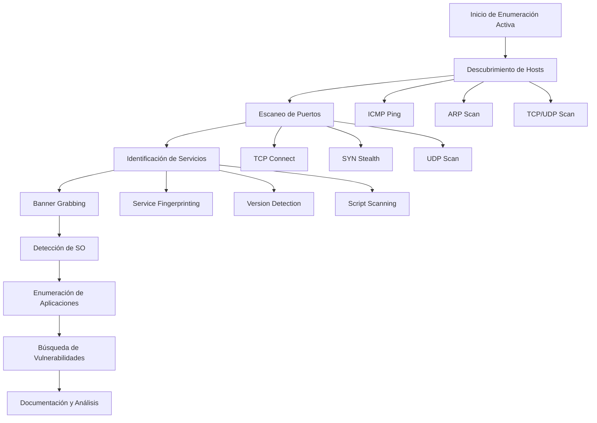
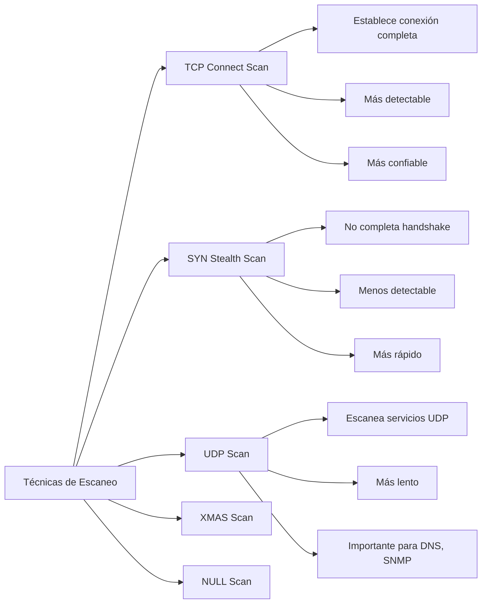
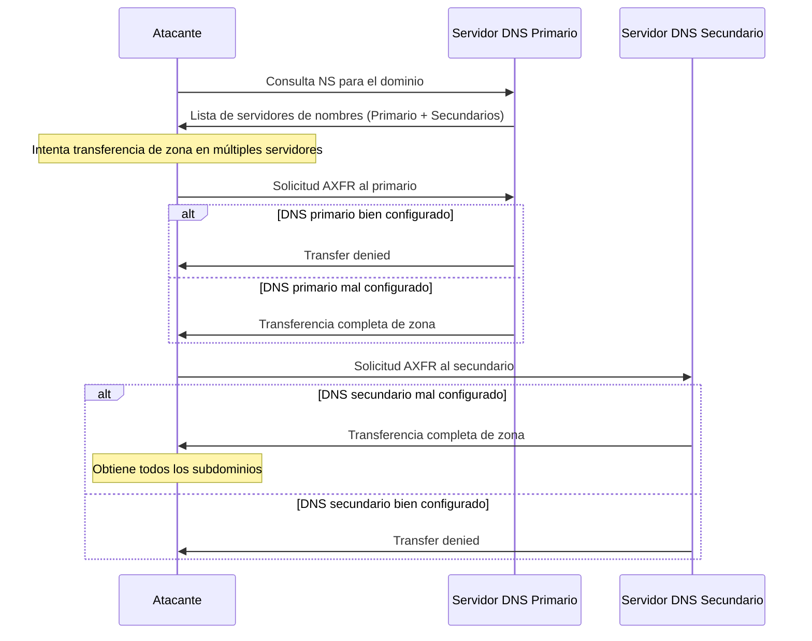
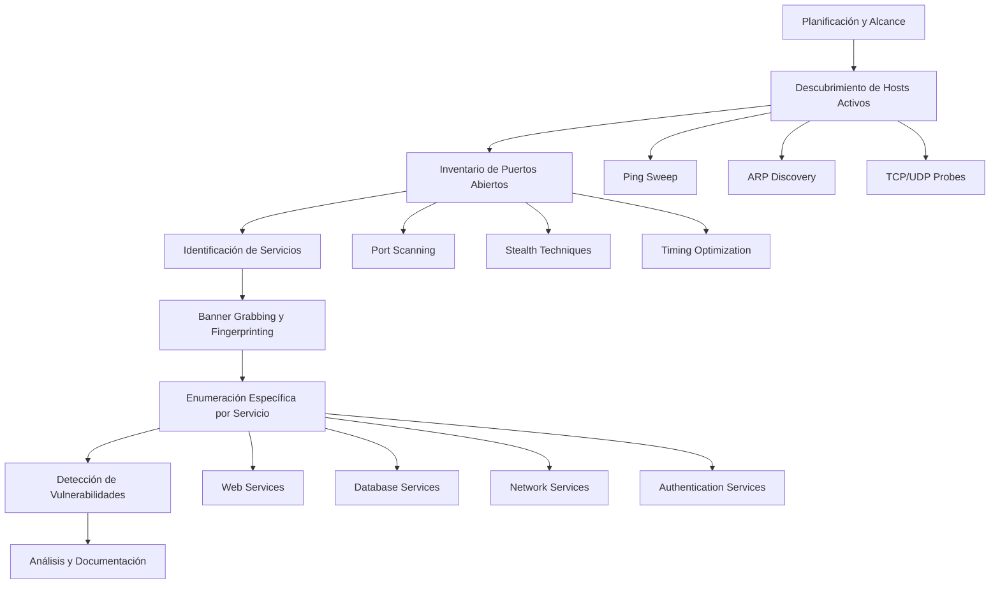

# Enumeración Activa en Pentesting: Técnicas y Herramientas Fundamentales para la Recolección de Información

La enumeración activa representa uno de los pilares fundamentales en cualquier ejercicio de pentesting, constituyendo la fase donde los profesionales de seguridad comienzan a interactuar directamente con los sistemas objetivo para obtener información crítica sobre la superficie de ataque[^5][^15]. Esta etapa marca el momento en que el análisis deja de ser meramente observacional para convertirse en una investigación proactiva que puede revelar vulnerabilidades explotables y configuraciones inseguras.

## ¿Qué es la Enumeración Activa?

La enumeración activa en ciberseguridad se define como el proceso sistemático de gathering information mediante el envío directo de consultas y paquetes a los sistemas objetivo[^5][^15]. A diferencia de las técnicas pasivas, este enfoque implica una comunicación bidireccional que puede ser detectada por sistemas de monitoreo, pero proporciona información mucho más precisa y detallada sobre la infraestructura analizada[^10].

Durante esta fase, los pentesters buscan identificar elementos críticos como direcciones IP activas, servicios en ejecución, versiones de sistemas operativos, aplicaciones instaladas, y dispositivos de seguridad como IDS/IPS y balanceadores de carga[^18][^19]. La información recopilada sirve como base para las siguientes fases del pentesting, permitiendo a los analistas desarrollar estrategias de explotación más efectivas.




## Diferencias Clave entre Enumeración Activa y Pasiva

La distinción entre enumeración activa y pasiva es fundamental para comprender los riesgos y beneficios de cada aproximación[^10]. **La enumeración pasiva** se basa en la recolección de información disponible públicamente sin interactuar directamente con el objetivo, utilizando fuentes como OSINT, registros DNS públicos, y motores de búsqueda especializados.

**La enumeración activa**, por el contrario, presenta las siguientes características distintivas[^10][^15]:

- **Interacción directa**: Envía paquetes y consultas específicas a los sistemas objetivo
- **Mayor riesgo de detección**: Las actividades pueden ser registradas por firewalls, IDS y sistemas de logging
- **Información más precisa**: Proporciona datos en tiempo real sobre el estado actual de los sistemas
- **Resultados verificables**: Permite confirmar la existencia y configuración de servicios específicos


## Herramientas y Técnicas Principales

### NMAP: La Herramienta Fundamental

NMAP (Network Mapper) constituye la herramienta esencial para la enumeración activa, ofreciendo capacidades avanzadas que van más allá del simple escaneo de puertos[^8][^23]. Esta utilidad de código abierto permite realizar una amplia gama de actividades de reconocimiento, desde el descubrimiento básico de hosts hasta la detección de vulnerabilidades específicas.

#### Comandos Básicos de NMAP

```bash
# Escaneo básico de host
nmap 192.168.1.1

# Escaneo de rango de red
nmap 192.168.1.0/24

# Escaneo de puertos específicos
nmap -p 80,443,22 192.168.1.1

# Escaneo completo de puertos
nmap -p- 192.168.1.1

# Escaneo sigiloso (SYN Scan)
nmap -sS 192.168.1.1

# Detección de versiones y OS
nmap -sV -O 192.168.1.1
```


#### Técnicas de Escaneo de Puertos

Las diferentes técnicas de escaneo ofrecen ventajas específicas según el contexto del pentesting[^8][^50]:




### Scripts NSE (Nmap Scripting Engine)

El Nmap Scripting Engine representa una de las características más poderosas de NMAP, permitiendo la automatización de tareas complejas de enumeración y detección de vulnerabilidades[^20][^23][^32]. Los scripts NSE utilizan el lenguaje Lua y se organizan en categorías específicas para facilitar su uso.

#### Categorías de Scripts NSE

Las principales categorías de scripts incluyen[^32][^23]:

- **auth**: Scripts para pruebas de autenticación
- **default**: Scripts básicos ejecutados por defecto
- **discovery**: Recuperación de información del objetivo
- **vuln**: Detección de vulnerabilidades conocidas
- **intrusive**: Scripts considerados intrusivos
- **safe**: Scripts seguros no intrusivos

```bash
# Ejecución de scripts por categoría
nmap --script vuln 192.168.1.1
nmap --script auth 192.168.1.1
nmap --script discovery 192.168.1.1

# Scripts específicos
nmap --script http-enum 192.168.1.1
nmap --script smb-enum-shares 192.168.1.1
nmap --script dns-zone-transfer 192.168.1.1
```


### Transferencia de Zona DNS

La transferencia de zona DNS constituye una técnica crítica en la enumeración activa que puede revelar información completa sobre la infraestructura de subdominios de una organización[^9][^13][^35]. Este proceso, conocido técnicamente como AXFR (Authoritative Transfer), está diseñado para sincronizar registros DNS entre servidores primarios y secundarios.

#### Proceso de Transferencia de Zona



La transferencia de zona puede exponer información crítica como[^13][^21]:

- Nombres de todos los subdominios
- Direcciones IP internas
- Configuraciones de servicios
- Estructura de la red interna

```bash
# Comandos para transferencia de zona
dig axfr example.com @ns1.example.com
nslookup
> set type=any
> ls -d example.com
```


### Banner Grabbing y Service Fingerprinting

El banner grabbing representa una técnica fundamental para identificar servicios, versiones y sistemas operativos[^48][^51]. Esta práctica permite obtener información detallada sobre las aplicaciones que se ejecutan en puertos específicos, revelando potenciales vectores de ataque.

#### Técnicas de Banner Grabbing

```bash
# Usando Telnet
telnet target_ip 80
HEAD / HTTP/1.0

# Usando Netcat
nc target_ip 25
EHLO test

# Usando NMAP
nmap -sV --script banner target_ip

# Usando cURL
curl -I http://target_ip
```


### Enumeración de Servicios Específicos

#### Enumeración HTTP/HTTPS

La enumeración de servicios web requiere técnicas especializadas para descobrir directorios, archivos y configuraciones[^12][^45]:

```bash
# Enumeración con NMAP
nmap --script http-enum target_ip
nmap --script http-methods target_ip
nmap --script http-headers target_ip

# Enumeración de directorios con Gobuster
gobuster dir -u http://target_ip -w /usr/share/wordlists/dirb/common.txt
gobuster dir -u http://target_ip -w wordlist.txt -x php,html,txt
```


#### Enumeración SSH

La enumeración de servicios SSH puede revelar información sobre algoritmos soportados, versiones y configuraciones[^14]:

```bash
# Información básica SSH
nmap --script ssh-enum-algos target_ip
nmap --script ssh-hostkey target_ip
nmap --script ssh-auth-methods target_ip
```


#### Enumeración SMB

Los servicios SMB frecuentemente contienen información sensible y configuraciones inseguras[^7]:

```bash
# Scripts NSE para SMB
nmap --script smb-enum-shares target_ip
nmap --script smb-enum-users target_ip
nmap --script smb-enum-domains target_ip
nmap --script smb-os-discovery target_ip
```


## Metodología de Enumeración Activa

Una metodología estructurada es esencial para maximizar la efectividad de la enumeración activa mientras se minimiza el riesgo de detección[^19][^40]:




### Fase 1: Descubrimiento de Hosts Activos

El descubrimiento inicial de hosts constituye el primer paso crítico[^16][^17]:

```bash
# Múltiples técnicas de descubrimiento
nmap -sn 192.168.1.0/24          # Ping scan
arp-scan -l                       # ARP discovery
fping -a -g 192.168.1.0/24       # Fast ping
masscan -p80,443 192.168.1.0/24  # Mass scanning
```


### Fase 2: Enumeración Sistemática de Puertos

Una vez identificados los hosts activos, se procede con el escaneo exhaustivo de puertos[^8]:

```bash
# Escaneo gradual para evitar detección
nmap -sS -T2 target_ip            # Stealth scan lento
nmap -sS -T4 -p- target_ip        # Escaneo completo agresivo
nmap -sU --top-ports 1000 target_ip  # Top UDP ports
```


### Fase 3: Identificación y Enumeración de Servicios

Para cada puerto abierto identificado, se realiza una enumeración detallada[^5][^7]:

```bash
# Identificación de versiones
nmap -sV -sC target_ip

# Scripts específicos por servicio
nmap --script "http-*" -p 80,443 target_ip
nmap --script "ssh-*" -p 22 target_ip
nmap --script "smb-*" -p 139,445 target_ip
```


## Consideraciones de Seguridad y Detección

La enumeración activa presenta riesgos inherentes de detección que deben ser cuidadosamente gestionados[^10][^27]. Los sistemas de detección modernos pueden identificar patrones de escaneo y generar alertas, por lo que es crucial implementar técnicas de evasión apropiadas.

### Técnicas de Evasión

```bash
# Timing controls para evitar detección
nmap -T1 target_ip                # Paranoid timing
nmap -T2 target_ip                # Sneaky timing
nmap --scan-delay 10s target_ip   # Delay entre probes

# Fragmentación de paquetes
nmap -f target_ip                 # Fragment packets
nmap --mtu 24 target_ip          # Maximum Transmission Unit

# Decoy scanning
nmap -D RND:10 target_ip         # Random decoys
nmap -D decoy1,decoy2,ME target_ip # Specific decoys
```


### Consideraciones Legales y Éticas

Es fundamental enfatizar que todas las técnicas de enumeración activa deben realizarse únicamente con autorización explícita del propietario del sistema[^2][^4]. El pentesting sin autorización constituye una actividad ilegal en la mayoría de jurisdicciones y puede resultar en consecuencias legales graves.

## Automatización y Herramientas Avanzadas

El desarrollo de herramientas automatizadas ha revolucionado la eficiencia de la enumeración activa[^17][^39]. Scripts personalizados y frameworks especializados permiten a los pentesters realizar reconocimiento comprehensive de manera más rápida y sistemática.

### Herramientas de Automatización

```bash
# Herramientas especializadas
AutoRecon target_ip              # Automated reconnaissance
enum4linux target_ip             # Linux/SMB enumeration
incursore target_ip               # Automated enumeration suite
sparta                           # GUI-based enumeration
```


### Desarrollo de Scripts Personalizados

El desarrollo de scripts bash personalizados permite automatizar tareas repetitivas[^17][^39]:

```bash
#!/bin/bash
# Script básico de enumeración
target=$1

echo "[+] Iniciando enumeración de $target"
echo "[+] Descubrimiento de puertos..."
nmap -sS -T4 -p- $target -oN ports_$target.txt

echo "[+] Enumeración de servicios..."
nmap -sV -sC $target -oN services_$target.txt

echo "[+] Scripts de vulnerabilidades..."
nmap --script vuln $target -oN vulns_$target.txt
```


## Conclusiones

La enumeración activa representa una fase crítica en cualquier ejercicio de pentesting, proporcionando la información fundamental necesaria para identificar vectores de ataque y vulnerabilidades explotables[^2][^19]. El dominio de herramientas como NMAP y sus scripts NSE, combinado con técnicas especializadas como la transferencia de zona DNS y el banner grabbing, permite a los profesionales de seguridad obtener una visión comprehensive de la superficie de ataque.

La efectividad de la enumeración activa depende no solo del conocimiento técnico de las herramientas, sino también de la implementación de una metodología estructurada que balancee la thoroughness del reconocimiento con la necesidad de mantener un perfil bajo para evitar la detección[^10][^27]. Los pentesters deben desarrollar un entendimiento profundo de cuándo y cómo aplicar diferentes técnicas según el contexto específico del engagement.

Finalmente, es crucial recordar que la enumeración activa debe realizarse siempre dentro de un marco legal y ético apropiado, con autorización explícita y respetando los límites establecidos en el scope del engagement[^2]. El conocimiento de estas técnicas debe utilizarse exclusivamente para fortalecer la seguridad de las organizaciones y contribuir a un cyberspace más seguro para todos.

La evolución continua de las técnicas de detección y las contramedidas implementadas por los defensores requiere que los profesionales de seguridad mantengan sus conocimientos actualizados y adapten constantemente sus metodologías para mantenerse efectivos en este campo dinámico y en constante evolución.

## Video base



## Referencias

[^1]: <a href="https://www.youtube.com/watch?v=fmq8WU5ADTM" target="_blank" rel="noopener">https://www.youtube.com/watch?v=fmq8WU5ADTM</a>

[^2]: <a href="https://arxiv.org/ftp/arxiv/papers/1908/1908.06970.pdf" target="_blank" rel="noopener">https://arxiv.org/ftp/arxiv/papers/1908/1908.06970.pdf</a>

[^3]: <a href="https://arxiv.org/abs/2011.13213" target="_blank" rel="noopener">https://arxiv.org/abs/2011.13213</a>

[^4]: <a href="https://arxiv.org/pdf/2306.04279.pdf" target="_blank" rel="noopener">https://arxiv.org/pdf/2306.04279.pdf</a>

[^5]: <a href="https://www.vertexcybersecurity.com.au/enumeration-in-penetration-testing-what-is-it/" target="_blank" rel="noopener">https://www.vertexcybersecurity.com.au/enumeration-in-penetration-testing-what-is-it/</a>

[^6]: <a href="https://www.vaadata.com/blog/active-directory-pentesting-objective-methodology-black-box-and-grey-box-tests/" target="_blank" rel="noopener">https://www.vaadata.com/blog/active-directory-pentesting-objective-methodology-black-box-and-grey-box-tests/</a>

[^7]: <a href="https://www.linkedin.com/pulse/100-enumeration-techniques-penetration-testing-from-oscp-tălmăcel-m6rwf" target="_blank" rel="noopener">https://www.linkedin.com/pulse/100-enumeration-techniques-penetration-testing-from-oscp-tălmăcel-m6rwf</a>

[^8]: <a href="https://www.recordedfuture.com/threat-intelligence-101/tools-and-techniques/nmap-commands" target="_blank" rel="noopener">https://www.recordedfuture.com/threat-intelligence-101/tools-and-techniques/nmap-commands</a>

[^9]: <a href="https://hackertarget.com/zone-transfer/" target="_blank" rel="noopener">https://hackertarget.com/zone-transfer/</a>

[^10]: <a href="https://www.blackhatethicalhacking.com/articles/breaking-down-active-and-passive-recon/" target="_blank" rel="noopener">https://www.blackhatethicalhacking.com/articles/breaking-down-active-and-passive-recon/</a>

[^11]: <a href="https://pentest-tools.com/blog/account-enumeration-techniques-pentesting" target="_blank" rel="noopener">https://pentest-tools.com/blog/account-enumeration-techniques-pentesting</a>

[^12]: <a href="https://www.scaler.com/topics/cyber-security/http-and-https-nmap/" target="_blank" rel="noopener">https://www.scaler.com/topics/cyber-security/http-and-https-nmap/</a>

[^13]: <a href="https://learn.microsoft.com/en-us/services-hub/unified/health/remediation-steps-ad/configure-all-dns-zones-only-to-allow-zone-transfers-to-specified-ip-addresses" target="_blank" rel="noopener">https://learn.microsoft.com/en-us/services-hub/unified/health/remediation-steps-ad/configure-all-dns-zones-only-to-allow-zone-transfers-to-specified-ip-addresses</a>

[^14]: <a href="https://www.scaler.com/topics/cyber-security/ssh-nmap/" target="_blank" rel="noopener">https://www.scaler.com/topics/cyber-security/ssh-nmap/</a>

[^15]: <a href="https://keepcoding.io/blog/enumeracion-activa-en-ciberseguridad/" target="_blank" rel="noopener">https://keepcoding.io/blog/enumeracion-activa-en-ciberseguridad/</a>

[^16]: <a href="https://www.youtube.com/watch?v=9N8s1QppzI0" target="_blank" rel="noopener">https://www.youtube.com/watch?v=9N8s1QppzI0</a>

[^17]: <a href="https://www.campusciberseguridad.com/blog-alumno/creacion-de-herramienta-de-enumeracion-y-escaneo" target="_blank" rel="noopener">https://www.campusciberseguridad.com/blog-alumno/creacion-de-herramienta-de-enumeracion-y-escaneo</a>

[^18]: <a href="https://www.dragonjar.org/pentesting-la-tecnica-enumeracion.xhtml" target="_blank" rel="noopener">https://www.dragonjar.org/pentesting-la-tecnica-enumeracion.xhtml</a>

[^19]: <a href="https://4geeks.com/es/lesson/fases-del-pentesting" target="_blank" rel="noopener">https://4geeks.com/es/lesson/fases-del-pentesting</a>

[^20]: <a href="https://thehackerway.es/2024/02/12/15-scripts-nse-disponibles-en-nmap/" target="_blank" rel="noopener">https://thehackerway.es/2024/02/12/15-scripts-nse-disponibles-en-nmap/</a>

[^21]: <a href="https://learn.microsoft.com/es-es/services-hub/unified/health/remediation-steps-ad/configure-all-dns-zones-only-to-allow-zone-transfers-to-specified-ip-addresses" target="_blank" rel="noopener">https://learn.microsoft.com/es-es/services-hub/unified/health/remediation-steps-ad/configure-all-dns-zones-only-to-allow-zone-transfers-to-specified-ip-addresses</a>

[^22]: <a href="https://achirou.com/4-herramientas-de-reconocimiento-y-escaneo-y-como-usarlas/" target="_blank" rel="noopener">https://achirou.com/4-herramientas-de-reconocimiento-y-escaneo-y-como-usarlas/</a>

[^23]: <a href="https://www.welivesecurity.com/la-es/2023/06/14/auditando-nmap-scripts-escanear-vulnerabilidades/" target="_blank" rel="noopener">https://www.welivesecurity.com/la-es/2023/06/14/auditando-nmap-scripts-escanear-vulnerabilidades/</a>

[^24]: <a href="https://arxiv.org/pdf/2010.10805.pdf" target="_blank" rel="noopener">https://arxiv.org/pdf/2010.10805.pdf</a>

[^25]: <a href="http://arxiv.org/pdf/2411.08182.pdf" target="_blank" rel="noopener">http://arxiv.org/pdf/2411.08182.pdf</a>

[^26]: <a href="https://pmc.ncbi.nlm.nih.gov/articles/PMC5648143/" target="_blank" rel="noopener">https://pmc.ncbi.nlm.nih.gov/articles/PMC5648143/</a>

[^27]: <a href="https://arxiv.org/pdf/2212.11449.pdf" target="_blank" rel="noopener">https://arxiv.org/pdf/2212.11449.pdf</a>

[^28]: <a href="https://arxiv.org/abs/2105.02388" target="_blank" rel="noopener">https://arxiv.org/abs/2105.02388</a>

[^29]: <a href="https://pmc.ncbi.nlm.nih.gov/articles/PMC9720441/" target="_blank" rel="noopener">https://pmc.ncbi.nlm.nih.gov/articles/PMC9720441/</a>

[^30]: <a href="https://arxiv.org/pdf/1901.11479.pdf" target="_blank" rel="noopener">https://arxiv.org/pdf/1901.11479.pdf</a>

[^31]: <a href="https://arxiv.org/pdf/2211.08517.pdf" target="_blank" rel="noopener">https://arxiv.org/pdf/2211.08517.pdf</a>

[^32]: <a href="https://nmap.org/book/man-nse.html" target="_blank" rel="noopener">https://nmap.org/book/man-nse.html</a>

[^33]: <a href="https://netlas.io/blog/cves_with_nmap/" target="_blank" rel="noopener">https://netlas.io/blog/cves_with_nmap/</a>

[^34]: <a href="https://github.com/nccgroup/nmap-nse-vulnerability-scripts" target="_blank" rel="noopener">https://github.com/nccgroup/nmap-nse-vulnerability-scripts</a>

[^35]: <a href="https://en.wikipedia.org/wiki/DNS_zone_transfer" target="_blank" rel="noopener">https://en.wikipedia.org/wiki/DNS_zone_transfer</a>

[^36]: <a href="https://www.ssh.com/academy/ssh/sftp-ssh-file-transfer-protocol" target="_blank" rel="noopener">https://www.ssh.com/academy/ssh/sftp-ssh-file-transfer-protocol</a>

[^37]: <a href="https://linuxsecurity.expert/compare/tools/network-port-scanners/" target="_blank" rel="noopener">https://linuxsecurity.expert/compare/tools/network-port-scanners/</a>

[^38]: <a href="https://support.dnsmadeeasy.com/support/solutions/articles/47001001342-import-records-from-a-name-server-using-axfr" target="_blank" rel="noopener">https://support.dnsmadeeasy.com/support/solutions/articles/47001001342-import-records-from-a-name-server-using-axfr</a>

[^39]: <a href="https://www.youtube.com/watch?v=4CKey4l490c" target="_blank" rel="noopener">https://www.youtube.com/watch?v=4CKey4l490c</a>

[^40]: <a href="https://www.skillsoft.com/course/comptia-pentest-applying-enumeration-techniques-9bfa4fa8-c989-41fa-887e-f884f4fadd1f" target="_blank" rel="noopener">https://www.skillsoft.com/course/comptia-pentest-applying-enumeration-techniques-9bfa4fa8-c989-41fa-887e-f884f4fadd1f</a>

[^41]: <a href="https://www.linkedin.com/pulse/active-reconnaissance-rajesh-gopalakrishnan" target="_blank" rel="noopener">https://www.linkedin.com/pulse/active-reconnaissance-rajesh-gopalakrishnan</a>

[^42]: <a href="https://s4e.io/tools/dns-zone-transfer" target="_blank" rel="noopener">https://s4e.io/tools/dns-zone-transfer</a>

[^43]: <a href="https://www.youtube.com/watch?v=Jukn6Zwpv64" target="_blank" rel="noopener">https://www.youtube.com/watch?v=Jukn6Zwpv64</a>

[^44]: <a href="https://heimdalsecurity.com/blog/what-is-nmap-and-how-to-use-it-to-enhance-network-security/" target="_blank" rel="noopener">https://heimdalsecurity.com/blog/what-is-nmap-and-how-to-use-it-to-enhance-network-security/</a>

[^45]: <a href="https://abrictosecurity.com/gobuster-directory-enumerator-cheat-sheet/" target="_blank" rel="noopener">https://abrictosecurity.com/gobuster-directory-enumerator-cheat-sheet/</a>

[^46]: <a href="https://github.com/OJ/gobuster" target="_blank" rel="noopener">https://github.com/OJ/gobuster</a>

[^47]: <a href="https://www.youtube.com/watch?v=PKLAF_p1LtM" target="_blank" rel="noopener">https://www.youtube.com/watch?v=PKLAF_p1LtM</a>

[^48]: <a href="https://www.utc.edu/document/71671" target="_blank" rel="noopener">https://www.utc.edu/document/71671</a>

[^49]: <a href="https://systemweakness.com/tryhackme-network-services-telnet-4112e2d9056d" target="_blank" rel="noopener">https://systemweakness.com/tryhackme-network-services-telnet-4112e2d9056d</a>

[^50]: <a href="https://www.linkedin.com/pulse/understanding-tcp-stealth-scans-rikunj-sindhwad-96upf" target="_blank" rel="noopener">https://www.linkedin.com/pulse/understanding-tcp-stealth-scans-rikunj-sindhwad-96upf</a>

[^51]: <a href="https://www.hackingarticles.in/multiple-ways-to-banner-grabbing/" target="_blank" rel="noopener">https://www.hackingarticles.in/multiple-ways-to-banner-grabbing/</a>

[^52]: <a href="https://fidelissecurity.com/cybersecurity-101/learn/network-enumeration/" target="_blank" rel="noopener">https://fidelissecurity.com/cybersecurity-101/learn/network-enumeration/</a>

[^53]: <a href="https://www.eccouncil.org/cybersecurity-exchange/ethical-hacking/enumeration-ethical-hacking/" target="_blank" rel="noopener">https://www.eccouncil.org/cybersecurity-exchange/ethical-hacking/enumeration-ethical-hacking/</a>

[^54]: <a href="https://eiposgrados.com/blog-ciberseguridad/segunda-fase-del-hacking/" target="_blank" rel="noopener">https://eiposgrados.com/blog-ciberseguridad/segunda-fase-del-hacking/</a>

[^55]: <a href="https://arxiv.org/pdf/1910.06826.pdf" target="_blank" rel="noopener">https://arxiv.org/pdf/1910.06826.pdf</a>

[^56]: <a href="https://arxiv.org/pdf/2306.05375.pdf" target="_blank" rel="noopener">https://arxiv.org/pdf/2306.05375.pdf</a>

[^57]: <a href="https://nmap.org/nsedoc/categories/vuln.html" target="_blank" rel="noopener">https://nmap.org/nsedoc/categories/vuln.html</a>

[^58]: <a href="https://nmap.org/nsedoc/scripts/vulners.html" target="_blank" rel="noopener">https://nmap.org/nsedoc/scripts/vulners.html</a>

[^59]: <a href="https://geekflare.com/cybersecurity/nmap-vulnerability-scan/" target="_blank" rel="noopener">https://geekflare.com/cybersecurity/nmap-vulnerability-scan/</a>

[^60]: <a href="https://www.esecurityplanet.com/networks/nmap-vulnerability-scanning-made-easy/" target="_blank" rel="noopener">https://www.esecurityplanet.com/networks/nmap-vulnerability-scanning-made-easy/</a>

[^61]: <a href="https://github.com/Diverto/nse-exchange" target="_blank" rel="noopener">https://github.com/Diverto/nse-exchange</a>

[^62]: <a href="https://github.com/ssstonebraker/Pentest-Service-Enumeration" target="_blank" rel="noopener">https://github.com/ssstonebraker/Pentest-Service-Enumeration</a>

[^63]: <a href="https://www.samgalope.dev/2024/09/23/network-scanning-tools-compared-nmap-masscan-and-others/" target="_blank" rel="noopener">https://www.samgalope.dev/2024/09/23/network-scanning-tools-compared-nmap-masscan-and-others/</a>

[^64]: <a href="https://www.youtube.com/watch?v=OnJBubBGadQ" target="_blank" rel="noopener">https://www.youtube.com/watch?v=OnJBubBGadQ</a>

[^65]: <a href="https://www.youtube.com/watch?v=x8LQ9WMZ2zE" target="_blank" rel="noopener">https://www.youtube.com/watch?v=x8LQ9WMZ2zE</a>

[^66]: <a href="https://www.youtube.com/watch?v=16HH_e9eNjE" target="_blank" rel="noopener">https://www.youtube.com/watch?v=16HH_e9eNjE</a>

[^67]: <a href="https://hackertarget.com/gobuster-tutorial/" target="_blank" rel="noopener">https://hackertarget.com/gobuster-tutorial/</a>

[^68]: <a href="https://www.kali.org/tools/gobuster/" target="_blank" rel="noopener">https://www.kali.org/tools/gobuster/</a>

[^69]: <a href="https://www.ceeyu.io/resources/blog/subdomain-enumeration-tools-and-techniques" target="_blank" rel="noopener">https://www.ceeyu.io/resources/blog/subdomain-enumeration-tools-and-techniques</a>
