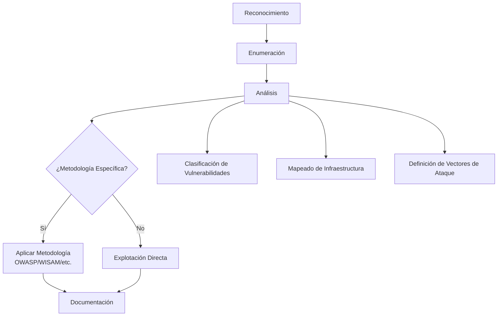
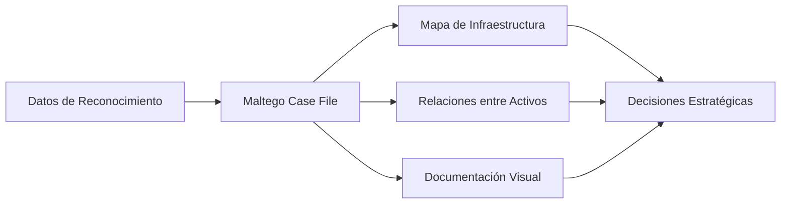
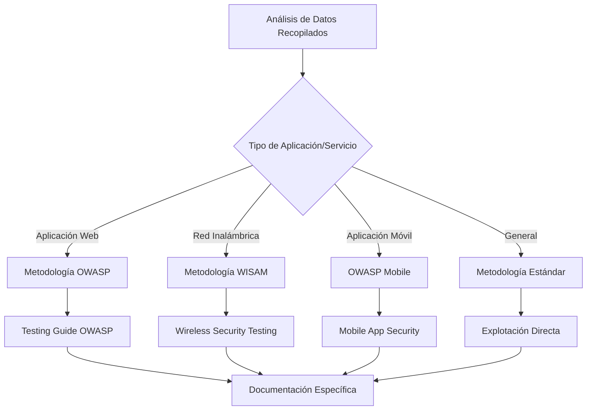
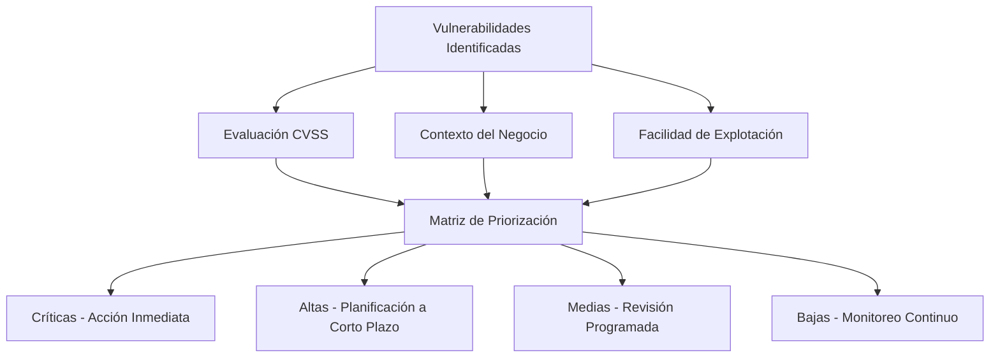

La fase de análisis en penetration testing representa uno de los momentos más cruciales de cualquier auditoría de seguridad informática. Durante esta etapa, los datos recopilados en las fases anteriores de reconocimiento y enumeración se transforman en información estratégica que define el éxito o fracaso de toda la evaluación de seguridad[^1]. Esta fase no solo determina qué vulnerabilidades existen, sino también establece la hoja de ruta para su explotación efectiva.

## Fundamentos del Análisis en Pentesting

### Definición y Propósito

El análisis en pentesting constituye la transición entre la recopilación pasiva de información y la explotación activa de vulnerabilidades[^8][^9]. En esta fase, los pentesters evalúan toda la información recolectada para identificar patrones, vulnerabilidades potenciales y vectores de ataque viables[^10]. El objetivo principal es crear una estrategia estructurada que maximice las posibilidades de compromiso exitoso mientras minimiza los riesgos para los sistemas objetivo[^1].

La importancia de esta fase radica en su capacidad para transformar datos dispersos en inteligencia accionable[^11]. Sin un análisis adecuado, los pentesters pueden encontrarse en callejones sin salida o perder oportunidades críticas de compromiso[^1]. Como señala la metodología DragonJAR, esta etapa es donde se toman las decisiones fundamentales que determinarán toda la ruta de la auditoría[^1].

### El Papel del Análisis en la Metodología de Pentesting

## Herramientas Fundamentales para el Análisis

### Nessus: El Estándar para Análisis de Vulnerabilidades

Nessus se ha establecido como la herramienta líder para el análisis de vulnerabilidades en pentesting[^12][^16][^33]. Con más de 100,000 plugins y actualizaciones en tiempo real, proporciona una base sólida para identificar vulnerabilidades conocidas en sistemas objetivo[^16]. Durante la fase de análisis, Nessus toma toda la información recopilada previamente sobre servicios, versiones y sistemas operativos para generar un reporte clasificado por criticidad[^1].

**Características Clave de Nessus en el Análisis:**

- Clasificación automática de vulnerabilidades por nivel de criticidad (Crítico, Alto, Medio, Bajo)[^16][^33]
- Correlación con bases de datos de vulnerabilidades conocidas[^12]
- Generación de informes detallados con vectores de explotación[^16]
- Capacidad de análisis tanto autenticado como no autenticado[^16]

Sin embargo, es importante entender las limitaciones de Nessus desde la perspectiva del pentester[^12]. Como señalan los expertos, Nessus fue diseñado para administradores de sistemas que buscan identificar vulnerabilidades para parchearlas, no para hackers éticos que buscan explotarlas[^12]. Esto significa que no todas las vulnerabilidades identificadas por Nessus tienen exploits disponibles o son realmente explotables en el contexto de la auditoría[^12].

### Maltego Case File: Visualización y Mapeo de Infraestructura

Maltego Case File emerge como una herramienta especializada para la visualización y análisis de relaciones durante el pentesting[^1][^17][^18]. A diferencia de Maltego tradicional, que se enfoca en transformaciones de datos OSINT, Case File está diseñado específicamente para diagramar y documentar entornos durante auditorías de seguridad[^1].

**Ventajas de Maltego Case File:**

- Visualización clara de la infraestructura objetivo[^1][^21]
- Identificación de relaciones no evidentes entre sistemas[^21]
- Documentación visual para informes de auditoría[^1]
- Capacidad de generar una visión global del entorno[^1]

## Metodologías Específicas en el Análisis

### Integración de Metodologías Especializadas

Una característica distintiva del enfoque profesional en pentesting es la capacidad de identificar cuándo aplicar metodologías específicas para ciertos tipos de infraestructura o aplicaciones[^1]. La metodología DragonJAR incorpora esta flexibilidad mediante un sistema de decisión que evalúa si el objetivo requiere un enfoque especializado[^1].

### OWASP para Aplicaciones Web

Cuando el análisis revela aplicaciones web como objetivos principales, la metodología OWASP Web Security Testing Guide (WSTG) se convierte en el estándar de facto[^19][^22]. Esta metodología proporciona un framework estructurado para evaluar la seguridad de aplicaciones web de manera exhaustiva[^19].

**Componentes Clave del Análisis OWASP:**

- Evaluación de controles de autenticación y autorización[^19]
- Análisis de gestión de sesiones[^19]
- Identificación de vulnerabilidades de inyección[^19]
- Evaluación de la configuración del servidor[^19]

### WISAM para Redes Inalámbricas

Para infraestructuras inalámbricas, metodologías como WISAM (Wireless Security Assessment Methodology) proporcionan un enfoque especializado[^1][^20][^24]. Estas metodologías abordan las particularidades únicas de la seguridad inalámbrica, incluyendo protocolos de cifrado, autenticación y gestión de claves[^20][^24].

## Proceso de Análisis y Toma de Decisiones

### Clasificación y Priorización de Vulnerabilidades

El proceso de análisis debe incluir una clasificación sistemática de las vulnerabilidades identificadas[^34][^36]. Esto implica no solo evaluar la severidad técnica según sistemas como CVSS, sino también considerar el contexto específico del entorno objetivo[^34].

### Definición de Vectores de Ataque

Durante la fase de análisis, es crucial identificar y mapear los posibles vectores de ataque[^31]. Esto incluye evaluar múltiples rutas de compromiso y seleccionar las más prometedoras basándose en la información recopilada[^1].

**Criterios para Selección de Vectores:**

- Probabilidad de éxito basada en vulnerabilidades identificadas[^31]
- Impacto potencial en los sistemas objetivo[^31]
- Recursos requeridos para la explotación[^31]
- Riesgo de detección y mitigación[^31]

## Documentación y Mapeo de Infraestructura

### Herramientas de Visualización

Además de Maltego Case File, herramientas como Microsoft Visio pueden complementar el proceso de documentación y análisis[^1]. La creación de diagramas de red y mapas de infraestructura ayuda a visualizar las relaciones entre sistemas y identificar rutas de ataque no evidentes[^1].

### Generación de Roadmaps Estratégicos

El análisis debe culminar en la creación de una hoja de ruta estratégica que guíe las fases posteriores del pentesting[^31]. Esta hoja de ruta debe incluir:

- Secuencia ordenada de ataques planificados[^31]
- Objetivos específicos para cada fase de explotación[^31]
- Criterios de éxito y puntos de decisión[^31]
- Planes de contingencia para diferentes escenarios[^31]

## Mejores Prácticas y Consideraciones Profesionales

### Validación Cruzada de Resultados

Una práctica fundamental en el análisis profesional de pentesting es la validación cruzada de resultados utilizando múltiples herramientas y técnicas[^12]. Esto ayuda a reducir falsos positivos y asegurar la precisión de los hallazgos[^12].

### Consideraciones Éticas y Legales

Durante la fase de análisis, es crucial mantener el enfoque dentro del alcance autorizado y considerar las implicaciones éticas de los vectores de ataque identificados[^13]. Esto incluye evaluar el potencial impacto en la disponibilidad de sistemas críticos y ajustar la estrategia en consecuencia[^13].

### Integración con el Ciclo de Vida de Seguridad

El análisis en pentesting no debe verse como un evento aislado, sino como parte integral del ciclo de vida de seguridad de la organización[^32]. Los resultados del análisis deben alimentar procesos continuos de mejora de la postura de seguridad[^32].

## Conclusión

La fase de análisis en pentesting representa la diferencia entre una auditoría mediocre y una evaluación de seguridad de clase mundial[^1]. A través del uso inteligente de herramientas como Nessus y Maltego Case File, combinado con la aplicación de metodologías específicas como OWASP y WISAM, los profesionales de seguridad pueden transformar datos brutos en estrategias de ataque precisas y efectivas[^1].

El éxito en esta fase requiere no solo dominio técnico de las herramientas, sino también la capacidad de pensamiento estratégico para conectar vulnerabilidades dispersas en narrativas coherentes de compromiso[^1]. Como enfatiza la metodología DragonJAR, aquellos que realizan auditorías sin seguir estos pasos estructurados están condenados a producir trabajos incompletos e inconcisos[^1].

La inversión en una fase de análisis robusta no solo optimiza las fases posteriores del pentesting, sino que también garantiza que cada decisión esté respaldada por datos sólidos y análisis riguroso[^1]. En un campo donde la precisión y la profesionalidad marcan la diferencia entre el éxito y el fracaso, dominar el arte del análisis en pentesting se convierte en una competencia indispensable para cualquier profesional de la seguridad informática.

## Referencias

[^1]: <a href="https://www.youtube.com/watch?v=voiffB3nJtI" target="_blank" rel="noopener">https://www.youtube.com/watch?v=voiffB3nJtI</a>

[^2]: <a href="https://www.mdpi.com/2076-3417/14/20/9331" target="_blank" rel="noopener">https://www.mdpi.com/2076-3417/14/20/9331</a>

[^3]: <a href="https://internationalpubls.com/index.php/cana/article/view/1817" target="_blank" rel="noopener">https://internationalpubls.com/index.php/cana/article/view/1817</a>

[^4]: <a href="https://pubsonline.informs.org/doi/10.1287/opre.2020.2086" target="_blank" rel="noopener">https://pubsonline.informs.org/doi/10.1287/opre.2020.2086</a>

[^5]: <a href="https://analyticalsciencejournals.onlinelibrary.wiley.com/doi/10.1002/dta.3689" target="_blank" rel="noopener">https://analyticalsciencejournals.onlinelibrary.wiley.com/doi/10.1002/dta.3689</a>

[^6]: <a href="https://www.tandfonline.com/doi/full/10.1080/19440049.2023.2171142" target="_blank" rel="noopener">https://www.tandfonline.com/doi/full/10.1080/19440049.2023.2171142</a>

[^7]: <a href="http://rnajournal.cshlp.org/lookup/doi/10.1261/rna.2278606" target="_blank" rel="noopener">http://rnajournal.cshlp.org/lookup/doi/10.1261/rna.2278606</a>

[^8]: <a href="https://www.getastra.com/blog/security-audit/penetration-testing-phases/" target="_blank" rel="noopener">https://www.getastra.com/blog/security-audit/penetration-testing-phases/</a>

[^9]: <a href="https://datami.ee/blog/penetration-test-steps-7-pentesting-process-phases/" target="_blank" rel="noopener">https://datami.ee/blog/penetration-test-steps-7-pentesting-process-phases/</a>

[^10]: <a href="https://blog.rsisecurity.com/the-4-phases-of-penetration-testing/" target="_blank" rel="noopener">https://blog.rsisecurity.com/the-4-phases-of-penetration-testing/</a>

[^11]: <a href="https://4geeks.com/es/lesson/fases-del-pentesting" target="_blank" rel="noopener">https://4geeks.com/es/lesson/fases-del-pentesting</a>

[^12]: <a href="https://www.youtube.com/watch?v=3pMZA2hsZmI" target="_blank" rel="noopener">https://www.youtube.com/watch?v=3pMZA2hsZmI</a>

[^13]: <a href="https://amatas.com/blog/penetration-testing-phases/" target="_blank" rel="noopener">https://amatas.com/blog/penetration-testing-phases/</a>

[^14]: <a href="https://admcloudservices.com/que-es-el-pentesting-y-cuales-son-sus-fases/" target="_blank" rel="noopener">https://admcloudservices.com/que-es-el-pentesting-y-cuales-son-sus-fases/</a>

[^15]: <a href="https://www.fortra.com/es/blog/las-seis-fases-del-pentesting" target="_blank" rel="noopener">https://www.fortra.com/es/blog/las-seis-fases-del-pentesting</a>

[^16]: <a href="https://www.fromdev.com/2025/01/how-to-use-nessus-for-penetration-testing-complete-guide-2025.html" target="_blank" rel="noopener">https://www.fromdev.com/2025/01/how-to-use-nessus-for-penetration-testing-complete-guide-2025.html</a>

[^17]: <a href="https://www.maltego.com" target="_blank" rel="noopener">https://www.maltego.com</a>

[^18]: <a href="https://github.com/deadbits/Analyst-CaseFile" target="_blank" rel="noopener">https://github.com/deadbits/Analyst-CaseFile</a>

[^19]: <a href="https://owasp.org/www-project-web-security-testing-guide/latest/4-Web_Application_Security_Testing/00-Introduction_and_Objectives/README" target="_blank" rel="noopener">https://owasp.org/www-project-web-security-testing-guide/latest/4-Web_Application_Security_Testing/00-Introduction_and_Objectives/README</a>

[^20]: <a href="https://www.triaxiomsecurity.com/our-wireless-penetration-testing-methodology/" target="_blank" rel="noopener">https://www.triaxiomsecurity.com/our-wireless-penetration-testing-methodology/</a>

[^21]: <a href="https://redfoxsec.com/blog/osint-with-maltego/" target="_blank" rel="noopener">https://redfoxsec.com/blog/osint-with-maltego/</a>

[^22]: <a href="https://www.sapphire.net/blogs-press-releases/owasp-methodology/" target="_blank" rel="noopener">https://www.sapphire.net/blogs-press-releases/owasp-methodology/</a>

[^23]: <a href="https://www.youtube.com/watch?v=TLdjUPjfhxY" target="_blank" rel="noopener">https://www.youtube.com/watch?v=TLdjUPjfhxY</a>

[^24]: <a href="https://qualysec.com/wireless-penetration-testing/" target="_blank" rel="noopener">https://qualysec.com/wireless-penetration-testing/</a>

[^25]: <a href="https://www.mdpi.com/2571-9408/6/9/323" target="_blank" rel="noopener">https://www.mdpi.com/2571-9408/6/9/323</a>

[^26]: <a href="https://www.ijfmr.com/research-paper.php?id=24517" target="_blank" rel="noopener">https://www.ijfmr.com/research-paper.php?id=24517</a>

[^27]: <a href="https://dl.acm.org/doi/10.1145/3708533" target="_blank" rel="noopener">https://dl.acm.org/doi/10.1145/3708533</a>

[^28]: <a href="http://bjgpopen.org/lookup/doi/10.3399/BJGPO.2021.0152" target="_blank" rel="noopener">http://bjgpopen.org/lookup/doi/10.3399/BJGPO.2021.0152</a>

[^29]: <a href="https://ieeexplore.ieee.org/document/9830729/" target="_blank" rel="noopener">https://ieeexplore.ieee.org/document/9830729/</a>

[^30]: <a href="https://ieeexplore.ieee.org/document/9689195/" target="_blank" rel="noopener">https://ieeexplore.ieee.org/document/9689195/</a>

[^31]: <a href="https://www.prancer.io/the-ultimate-penetration-testing-roadmap-for-cybersecurity-success/" target="_blank" rel="noopener">https://www.prancer.io/the-ultimate-penetration-testing-roadmap-for-cybersecurity-success/</a>

[^32]: <a href="https://www.linkedin.com/pulse/top-4-penetration-testing-methodologies-overview-assessment-roadmap-x5e6f" target="_blank" rel="noopener">https://www.linkedin.com/pulse/top-4-penetration-testing-methodologies-overview-assessment-roadmap-x5e6f</a>

[^33]: <a href="https://blog.hackmetrix.com/herramientas-para-el-analisis-de-vulnerabilidades-en-pymes/" target="_blank" rel="noopener">https://blog.hackmetrix.com/herramientas-para-el-analisis-de-vulnerabilidades-en-pymes/</a>

[^34]: <a href="https://www.ninjaone.com/es/blog/priorizacion-de-vulnerabilidades/" target="_blank" rel="noopener">https://www.ninjaone.com/es/blog/priorizacion-de-vulnerabilidades/</a>

[^35]: <a href="https://www.revistacloudcomputing.com/2024/02/4-herramientas-gratuitas-para-el-analisis-de-vulnerabilidades/" target="_blank" rel="noopener">https://www.revistacloudcomputing.com/2024/02/4-herramientas-gratuitas-para-el-analisis-de-vulnerabilidades/</a>

[^36]: <a href="https://logicsolutions.es/es/blog/como-priorizar-respuestas-tras-un-analisis-de-vulnerabilidades" target="_blank" rel="noopener">https://logicsolutions.es/es/blog/como-priorizar-respuestas-tras-un-analisis-de-vulnerabilidades</a>

[^37]: <a href="https://www.gb-advisors.com/es/blog/priorizacion-de-vulnerabilidades-como-proteger-mejor-sus-sistemas" target="_blank" rel="noopener">https://www.gb-advisors.com/es/blog/priorizacion-de-vulnerabilidades-como-proteger-mejor-sus-sistemas</a>

[^38]: <a href="https://ejars.journals.ekb.eg/article_396688.html" target="_blank" rel="noopener">https://ejars.journals.ekb.eg/article_396688.html</a>

[^39]: <a href="https://bmcmedinformdecismak.biomedcentral.com/articles/10.1186/s12911-024-02821-8" target="_blank" rel="noopener">https://bmcmedinformdecismak.biomedcentral.com/articles/10.1186/s12911-024-02821-8</a>

[^40]: <a href="https://onlinelibrary.wiley.com/doi/10.1002/pro.3943" target="_blank" rel="noopener">https://onlinelibrary.wiley.com/doi/10.1002/pro.3943</a>

[^41]: <a href="https://isprs-annals.copernicus.org/articles/V-2-2021/113/2021/" target="_blank" rel="noopener">https://isprs-annals.copernicus.org/articles/V-2-2021/113/2021/</a>

[^42]: <a href="https://isprs-archives.copernicus.org/articles/XLVI-2-W1-2022/1/2022/" target="_blank" rel="noopener">https://isprs-archives.copernicus.org/articles/XLVI-2-W1-2022/1/2022/</a>

[^43]: <a href="https://isprs-archives.copernicus.org/articles/XLIII-B2-2020/837/2020/" target="_blank" rel="noopener">https://isprs-archives.copernicus.org/articles/XLIII-B2-2020/837/2020/</a>

[^44]: <a href="https://strobes.co/blog/web-application-penetration-testing-tools/" target="_blank" rel="noopener">https://strobes.co/blog/web-application-penetration-testing-tools/</a>

[^45]: <a href="https://firecompass.com/best-penetration-testing-tools/" target="_blank" rel="noopener">https://firecompass.com/best-penetration-testing-tools/</a>

[^46]: <a href="https://www.yeswehack.com/learn-bug-bounty/5-tools-white-box-pentesting" target="_blank" rel="noopener">https://www.yeswehack.com/learn-bug-bounty/5-tools-white-box-pentesting</a>

[^47]: <a href="https://s2grupo.es/pentesting-que-es-y-como-se-plantea-una-auditoria-pentesting/" target="_blank" rel="noopener">https://s2grupo.es/pentesting-que-es-y-como-se-plantea-una-auditoria-pentesting/</a>

[^48]: <a href="https://www.dragonjar.org/como-efectuar-un-pentesting.xhtml" target="_blank" rel="noopener">https://www.dragonjar.org/como-efectuar-un-pentesting.xhtml</a>

[^49]: <a href="https://netlas.io/blog/7_tools_for_web_penetration_testing/" target="_blank" rel="noopener">https://netlas.io/blog/7_tools_for_web_penetration_testing/</a>

[^50]: <a href="https://thectoclub.com/tools/best-penetration-testing-tools/" target="_blank" rel="noopener">https://thectoclub.com/tools/best-penetration-testing-tools/</a>

[^51]: <a href="https://founderz.com/es/blog/pentesting-ciberseguridad/" target="_blank" rel="noopener">https://founderz.com/es/blog/pentesting-ciberseguridad/</a>

[^52]: <a href="https://www.dragonjar.org/fases-de-una-prueba-de-penetracion.xhtml" target="_blank" rel="noopener">https://www.dragonjar.org/fases-de-una-prueba-de-penetracion.xhtml</a>

[^53]: <a href="https://www.youtube.com/watch?v=2Bayq6zP9VA" target="_blank" rel="noopener">https://www.youtube.com/watch?v=2Bayq6zP9VA</a>

[^54]: <a href="https://www.youtube.com/watch?v=kWe61onkxK0" target="_blank" rel="noopener">https://www.youtube.com/watch?v=kWe61onkxK0</a>

[^55]: <a href="https://www.youtube.com/watch?v=9KyuuJJ_tyU" target="_blank" rel="noopener">https://www.youtube.com/watch?v=9KyuuJJ_tyU</a>

[^56]: <a href="https://www.youtube.com/watch?v=cJ6uEzMzRPM" target="_blank" rel="noopener">https://www.youtube.com/watch?v=cJ6uEzMzRPM</a>

[^57]: <a href="https://www.youtube.com/watch?v=nygT5hlsIJk" target="_blank" rel="noopener">https://www.youtube.com/watch?v=nygT5hlsIJk</a>

[^58]: <a href="https://achirou.com/pentesting-con-enfoque-owasp-fases-y-metodologia/" target="_blank" rel="noopener">https://achirou.com/pentesting-con-enfoque-owasp-fases-y-metodologia/</a>

[^59]: <a href="https://www.arsys.es/blog/owasp" target="_blank" rel="noopener">https://www.arsys.es/blog/owasp</a>

[^60]: <a href="https://www.youtube.com/watch?v=-8l2Hqp-eRo" target="_blank" rel="noopener">https://www.youtube.com/watch?v=-8l2Hqp-eRo</a>

[^61]: <a href="https://www.dragonjar.org/owasp-testing-guide-4-0-en-espanol.xhtml" target="_blank" rel="noopener">https://www.dragonjar.org/owasp-testing-guide-4-0-en-espanol.xhtml</a>

[^62]: <a href="https://www.drnoecuervo.mx/wp-content/uploads/2023/06/Tema-2-Comandos-Maltego-I.pdf" target="_blank" rel="noopener">https://www.drnoecuervo.mx/wp-content/uploads/2023/06/Tema-2-Comandos-Maltego-I.pdf</a>

[^63]: <a href="https://linkinghub.elsevier.com/retrieve/pii/S088915752200076X" target="_blank" rel="noopener">https://linkinghub.elsevier.com/retrieve/pii/S088915752200076X</a>

[^64]: <a href="https://www.semanticscholar.org/paper/d801ef5401f90f535e0b2d7cd82a6ba11fdddc72" target="_blank" rel="noopener">https://www.semanticscholar.org/paper/d801ef5401f90f535e0b2d7cd82a6ba11fdddc72</a>

[^65]: <a href="https://journals.sagepub.com/doi/10.1177/16094069231183620" target="_blank" rel="noopener">https://journals.sagepub.com/doi/10.1177/16094069231183620</a>

[^66]: <a href="https://link.springer.com/10.1007/s10973-024-13659-7" target="_blank" rel="noopener">https://link.springer.com/10.1007/s10973-024-13659-7</a>

[^67]: <a href="https://www.vaadata.com/blog/penetration-testing-methodology-scope-and-types-of-pentests/" target="_blank" rel="noopener">https://www.vaadata.com/blog/penetration-testing-methodology-scope-and-types-of-pentests/</a>

[^68]: <a href="https://owasp.org/www-project-web-security-testing-guide/latest/3-The_OWASP_Testing_Framework/1-Penetration_Testing_Methodologies" target="_blank" rel="noopener">https://owasp.org/www-project-web-security-testing-guide/latest/3-The_OWASP_Testing_Framework/1-Penetration_Testing_Methodologies</a>

[^69]: <a href="https://www.semanticscholar.org/paper/2b09ab449a506ffe4149d1a4f43c1c8602b70ad4" target="_blank" rel="noopener">https://www.semanticscholar.org/paper/2b09ab449a506ffe4149d1a4f43c1c8602b70ad4</a>

[^70]: <a href="https://www.maltego.com/transform-hub/casefile-entities/" target="_blank" rel="noopener">https://www.maltego.com/transform-hub/casefile-entities/</a>

[^71]: <a href="https://www.reydes.com/e/Maltego_Casefile" target="_blank" rel="noopener">https://www.reydes.com/e/Maltego_Casefile</a>

[^72]: <a href="https://docs.maltego.com/en/support/solutions/articles/15000018995-penetration-testing" target="_blank" rel="noopener">https://docs.maltego.com/en/support/solutions/articles/15000018995-penetration-testing</a>

[^73]: <a href="https://linkinghub.elsevier.com/retrieve/pii/S1877050923010785" target="_blank" rel="noopener">https://linkinghub.elsevier.com/retrieve/pii/S1877050923010785</a>

[^74]: <a href="https://journals.lww.com/10.1681/ASN.0000000635" target="_blank" rel="noopener">https://journals.lww.com/10.1681/ASN.0000000635</a>

[^75]: <a href="https://www.ewadirect.com/proceedings/ace/article/view/10162" target="_blank" rel="noopener">https://www.ewadirect.com/proceedings/ace/article/view/10162</a>

[^76]: <a href="https://github.com/ossamayasserr/WebAppPentestRoadmap" target="_blank" rel="noopener">https://github.com/ossamayasserr/WebAppPentestRoadmap</a>

[^77]: <a href="https://roadmap.sh/r/ethical-hacking-yyvh9" target="_blank" rel="noopener">https://roadmap.sh/r/ethical-hacking-yyvh9</a>

[^78]: <a href="https://tcm-sec.com/tcm-pentester-certification-roadmap/" target="_blank" rel="noopener">https://tcm-sec.com/tcm-pentester-certification-roadmap/</a>

[^79]: <a href="https://cybercx.com.au/resource/penetration-testing-guide/" target="_blank" rel="noopener">https://cybercx.com.au/resource/penetration-testing-guide/</a>

[^80]: <a href="https://www.semanticscholar.org/paper/99362e8e2efb5c4f17d8ee969b1d5d86bdf023d2" target="_blank" rel="noopener">https://www.semanticscholar.org/paper/99362e8e2efb5c4f17d8ee969b1d5d86bdf023d2</a>

[^81]: <a href="https://www.semanticscholar.org/paper/7604535080a3304d55aa0333ebf28935b3207243" target="_blank" rel="noopener">https://www.semanticscholar.org/paper/7604535080a3304d55aa0333ebf28935b3207243</a>

[^82]: <a href="https://www.semanticscholar.org/paper/02a94c109fbedb31e5db8a560cc71a9b74f3e55b" target="_blank" rel="noopener">https://www.semanticscholar.org/paper/02a94c109fbedb31e5db8a560cc71a9b74f3e55b</a>

[^83]: <a href="https://isprs-archives.copernicus.org/articles/XLVI-M-1-2021/395/2021/" target="_blank" rel="noopener">https://isprs-archives.copernicus.org/articles/XLVI-M-1-2021/395/2021/</a>

[^84]: <a href="https://github.com/enaqx/awesome-pentest" target="_blank" rel="noopener">https://github.com/enaqx/awesome-pentest</a>

[^85]: <a href="https://www.darkreading.com/cyber-risk/data-visualization-for-faster-more-effective-pen-testing" target="_blank" rel="noopener">https://www.darkreading.com/cyber-risk/data-visualization-for-faster-more-effective-pen-testing</a>

[^86]: <a href="https://zerothreat.ai/blog/penetration-testing-reporting-tools" target="_blank" rel="noopener">https://zerothreat.ai/blog/penetration-testing-reporting-tools</a>

[^87]: <a href="https://www.hiberus.com/crecemos-contigo/pentesting-owasp-fases-metodologia/" target="_blank" rel="noopener">https://www.hiberus.com/crecemos-contigo/pentesting-owasp-fases-metodologia/</a>
