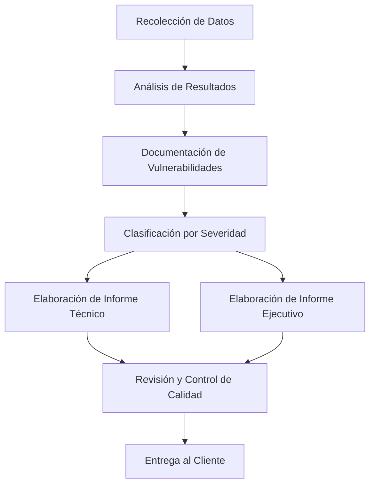
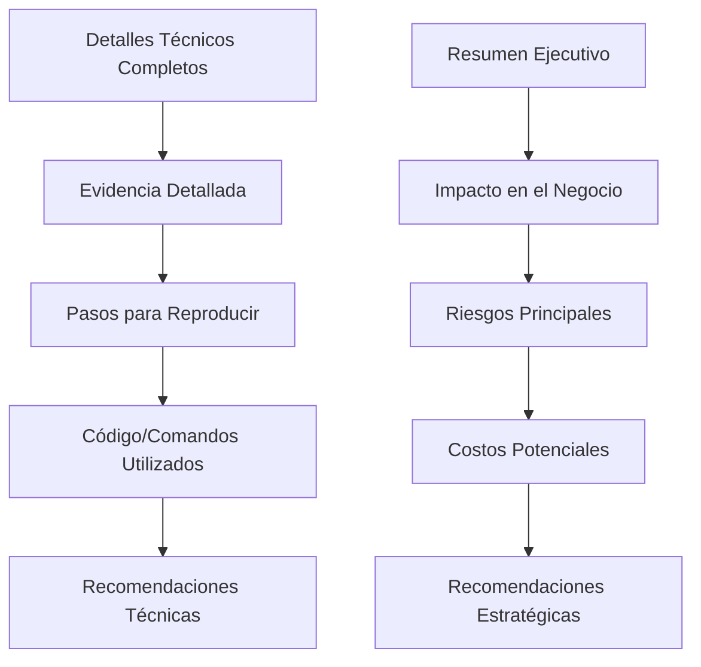
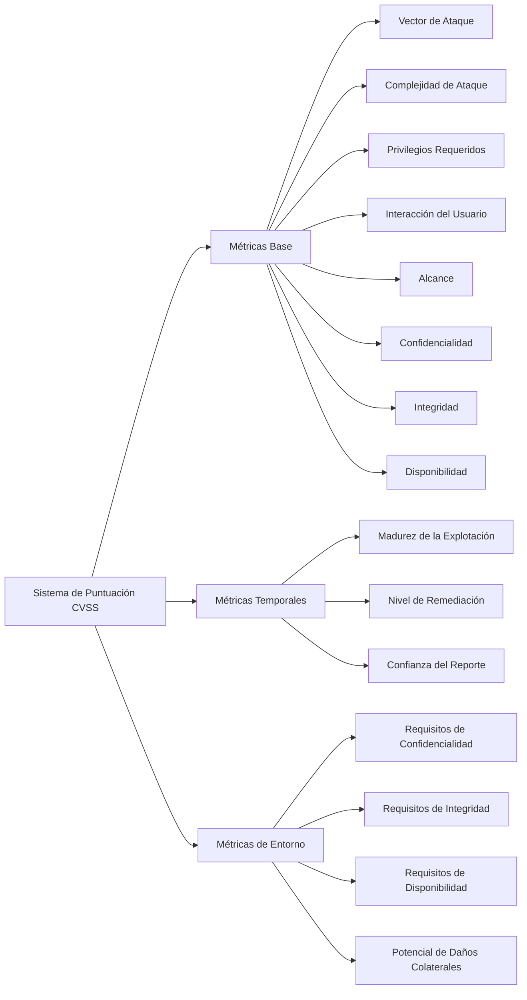
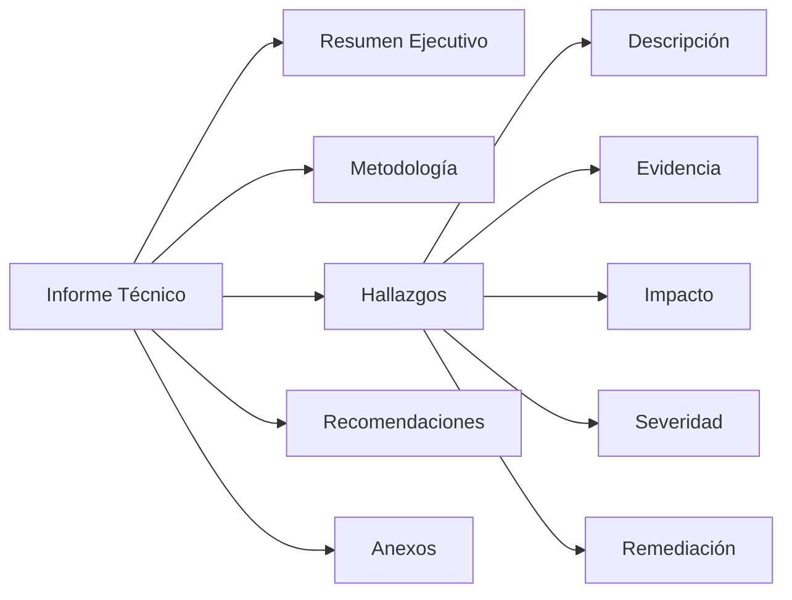
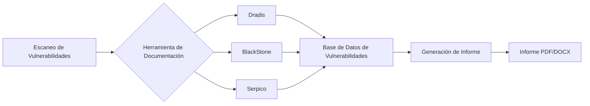

La documentación representa la fase culminante y más crítica de cualquier proceso de pentesting, siendo el producto tangible que determina la percepción del valor del trabajo realizado[^7][^21]. Como destaca Jaime Andrés Restrepo en su curso de introducción al pentesting, la documentación no solo resume los hallazgos técnicos, sino que proyecta la imagen profesional del auditor y constituye la herramienta principal para la corrección de vulnerabilidades[^7][^21]. Esta fase, frecuentemente subestimada, puede representar hasta el 40% del tiempo total invertido en una auditoría de seguridad[^54], lo que subraya su importancia estratégica en el ecosistema de la ciberseguridad.

## Proceso Integral de Documentación en Pentesting

El proceso de documentación en pentesting sigue un flujo estructurado que transforma datos técnicos brutos en información accionable para diferentes audiencias[^7][^21]. Este proceso debe ser sistemático, reproducible y alineado con estándares reconocidos internacionalmente[^26][^27].

### Recolección y Análisis de Datos

La documentación efectiva comienza durante la fase de ejecución del pentesting, donde cada hallazgo debe ser registrado meticulosamente con evidencia detallada[^21][^35]. Esta evidencia incluye capturas de pantalla, comandos ejecutados, respuestas del sistema y cualquier artefacto digital que respalde los descubrimientos[^21]. La calidad de la documentación inicial determina directamente la credibilidad del informe final[^10][^35].

## Tipología de Informes: Técnico vs. Ejecutivo

La diferenciación entre informes técnicos y ejecutivos constituye uno de los aspectos más críticos de la documentación en pentesting[^7][^21]. Esta dualidad responde a las diferentes necesidades de información de las audiencias objetivo y requiere enfoques de comunicación completamente distintos[^13][^35].

### Informe Técnico: Manual de Replicación

El informe técnico debe funcionar como un manual detallado que permita a cualquier profesional técnico replicar los hallazgos y verificar las vulnerabilidades identificadas[^7][^21][^22]. Este documento requiere un nivel de detalle exhaustivo que incluya la metodología empleada, las herramientas utilizadas, los comandos ejecutados y las evidencias completas de cada vulnerabilidad[^22][^35]. El objetivo principal es proporcionar al equipo técnico de la organización toda la información necesaria para entender, verificar y corregir los problemas de seguridad identificados[^21][^22].

### Informe Ejecutivo: Traducción al Impacto de Negocio

El informe ejecutivo representa un ejercicio de traducción complejo donde los hallazgos técnicos se transforman en métricas de riesgo empresarial[^7][^13]. Este documento debe utilizar un lenguaje accesible para directivos no técnicos, empleando analogías cotidianas para explicar conceptos complejos[^7]. Como ilustra Restrepo con el ejemplo de la denegación de servicio comparada con una tienda saturada de clientes, la capacidad de simplificar conceptos técnicos sin perder precisión constituye una habilidad fundamental del documentador[^7][^13].

## Metodologías y Estándares de Documentación

### Framework PTES (Penetration Testing Execution Standard)

El estándar PTES proporciona un marco estructurado para la documentación de pentesting que abarca desde la fase de pre-engagement hasta la entrega del informe final[^26][^34][^37]. Esta metodología enfatiza la importancia de documentar no solo los hallazgos, sino también el proceso completo de testing, incluyendo las limitaciones del alcance y las reglas de engagement[^34][^37]. La documentación bajo PTES debe incluir evidencia detallada de cada fase del pentesting, desde el reconocimiento inicial hasta la post-explotación[^34].

### Metodología OWASP para Aplicaciones Web

Para auditorías de aplicaciones web, la metodología OWASP proporciona un framework específico que incluye criterios de documentación para cada una de las vulnerabilidades del Top 10[^27][^28][^29]. La documentación debe seguir los parámetros establecidos por OWASP para la clasificación de vulnerabilidades, incluyendo la descripción del riesgo, el impacto potencial y las recomendaciones de mitigación específicas[^27][^29]. Esta estandarización facilita la comprensión y priorización de los hallazgos por parte de los equipos de desarrollo[^28][^29].

### Sistema de Puntuación CVSS

La implementación del Common Vulnerability Scoring System (CVSS) constituye un elemento esencial para la documentación standardizada de vulnerabilidades[^27][^36][^38]. CVSS proporciona un marco objetivo para evaluar la severidad de las vulnerabilidades mediante métricas cuantificables que consideran el vector de ataque, la complejidad, los privilegios requeridos y el impacto en la confidencialidad, integridad y disponibilidad[^36][^38].

## Estructura y Componentes del Informe Técnico

La estructura del informe técnico debe seguir una secuencia lógica que facilite la comprensión y utilización por parte del equipo técnico receptor[^22][^35]. Cada sección cumple una función específica en el proceso de comunicación y corrección de vulnerabilidades[^21][^35].

### Portada y Metadata del Documento

La portada debe incluir información esencial como la fecha de elaboración, la versión del documento, el cliente objetivo y el equipo responsable de la auditoría[^35][^22]. El control de versiones resulta crítico para evitar confusiones durante el proceso de review y corrección[^35]. La metadata debe incluir también las restricciones de confidencialidad y los términos de uso del documento[^21][^35].

### Resumen Ejecutivo Técnico

A diferencia del resumen ejecutivo del informe para directivos, esta sección debe proporcionar una visión técnica consolidada de los hallazgos principales, priorizados según su criticidad y impacto[^10][^35]. Debe incluir métricas cuantificables como el número total de vulnerabilidades encontradas, su distribución por severidad y una evaluación general del postura de seguridad[^10][^22].

### Metodología y Alcance

Esta sección debe documentar exhaustivamente las metodologías empleadas, las herramientas utilizadas, el alcance de la auditoría y las limitaciones encontradas[^22][^35]. La transparencia en la metodología permite al cliente evaluar la completitud de la auditoría y planificar futuras evaluaciones[^21][^35]. Debe incluirse también información sobre las reglas de engagement y cualquier restricción operacional que haya afectado el testing[^34][^35].

### Documentación de Hallazgos

Cada vulnerabilidad identificada debe ser documentada siguiendo un formato estandarizado que incluya[^21[^25][^35]:

- **Descripción técnica detallada**: Explicación precisa de la vulnerabilidad y su contexto
- **Evidencia completa**: Capturas de pantalla, logs, comandos ejecutados y respuestas del sistema
- **Pasos para reproducir**: Instrucciones detalladas que permitan replicar el hallazgo
- **Impacto técnico y de negocio**: Evaluación de las consecuencias potenciales
- **Calificación CVSS**: Puntuación objetiva según los estándares internacionales
- **Recomendaciones de remediación**: Pasos específicos para corregir la vulnerabilidad

## Herramientas de Documentación Especializadas

La automatización de la documentación mediante herramientas especializadas representa una tendencia creciente que permite reducir significativamente el tiempo invertido en la elaboración de informes[^40][^54][^55]. Estas herramientas facilitan la estandarización de formatos y la integración con los resultados de herramientas de scanning[^55][^57].

### Dradis Framework

Dradis constituye una de las herramientas más establecidas para la documentación colaborativa en pentesting[^55][^57]. Su arquitectura permite la integración directa con herramientas populares como Nmap, Nessus, Burp Suite y Metasploit, facilitando la importación automática de resultados[^55][^57]. La capacidad de colaboración en tiempo real hace de Dradis una opción preferida para equipos que trabajan simultáneamente en diferentes aspectos de una auditoría[^57].

### BlackStone Project

BlackStone representa una solución innovadora desarrollada específicamente para el mercado hispanohablante, ofreciendo una base de datos de más de 200 vulnerabilidades predefinidas y templates personalizables[^53][^54]. La herramienta permite la gestión integral del proceso de documentación, desde la creación de clientes hasta la generación automática de informes en formato profesional[^54]. Su interfaz intuitiva y la posibilidad de despliegue mediante Docker facilitan su adopción en diferentes entornos de trabajo[^53][^54].

### Serpico

Aunque actualmente archivado, Serpico estableció importantes precedentes en la automatización de reportes de pentesting[^58]. Su enfoque en la simplicidad de templates y la filosofía de que "editar un template debe ser fácil" influyó significativamente en el desarrollo de herramientas posteriores[^58]. La capacidad de personalización completa de templates y el uso de un lenguaje de markup específico para la inserción de datos dinámicos representaron innovaciones importantes en el campo[^58].

## Mejores Prácticas en Documentación de Pentesting

### Presentación Visual y Profesional

La presentación física y digital del informe impacta directamente en la percepción del valor del servicio prestado[^7][^21]. Restrepo enfatiza la importancia de invertir en la calidad visual del documento, incluyendo la impresión en alta calidad y el encuadernado profesional[^7]. Esta atención al detalle refuerza la percepción de profesionalismo y justifica la inversión realizada por el cliente[^7][^21].

### Control de Versiones y Calidad

La implementación de un sistema robusto de control de versiones previene confusiones durante el proceso de review y corrección[^35]. Cada versión debe incluir un registro detallado de los cambios realizados, la fecha de modificación y el responsable de la actualización[^35]. La revisión por pares constituye una práctica esencial para garantizar la calidad técnica y la precisión de la información presentada[^8][^10].

### Comunicación de Conceptos Complejos

La habilidad para traducir conceptos técnicos complejos a un lenguaje comprensible para diferentes audiencias representa una competencia fundamental del documentador[^7][^13]. El uso de analogías cotidianas, como la comparación de una denegación de servicio con una tienda saturada, facilita la comprensión sin comprometer la precisión técnica[^7]. Esta capacidad de comunicación efectiva diferencia a los profesionales experimentados de los novatos en el campo[^13].

### Gestión de Hallazgos Críticos

Para vulnerabilidades de severidad crítica que representen un riesgo inmediato, debe implementarse un protocolo de comunicación urgente que incluya contacto telefónico directo y la preparación de un informe preliminar informal[^7][^21]. Esta práctica demuestra responsabilidad profesional y puede prevenir incidentes de seguridad mientras se prepara el informe formal completo[^7].

## Tendencias Actuales y Futuras

### Automatización e Inteligencia Artificial

La integración de tecnologías de automatización robótica de procesos (RPA) en la documentación de pentesting representa una tendencia emergente que promete reducir significativamente el tiempo invertido en tareas repetitivas[^40]. La aplicación de inteligencia artificial para la clasificación automática de vulnerabilidades y la generación de recomendaciones contextuales constituye un área de desarrollo activo[^28][^40].

### Integración Continua y DevSecOps

La evolución hacia metodologías DevSecOps requiere adaptaciones en los procesos de documentación para soportar ciclos de desarrollo más rápidos[^28]. Los informes deben ser más ágiles, frecuentes y automatizados, integrándose directamente en los pipelines de desarrollo[^28][^40]. Esta transformación implica un cambio desde informes monolíticos hacia dashboards dinámicos y notificaciones en tiempo real[^40].

### Cumplimiento Normativo y Estándares

El estudio anual de Fortra 2024 indica que el 43% de las organizaciones realizan pentesting principalmente para cumplir con estándares como PCI DSS[^49][^52]. Esta tendencia hacia el compliance-driven testing requiere documentación específica que demuestre adherencia a marcos normativos específicos[^49][^52]. La documentación debe evolucionar para satisfacer simultáneamente los requerimientos técnicos y regulatorios[^52].

### Herramientas Open Source vs. Comerciales

Los datos actuales muestran una preferencia creciente por herramientas de código abierto (33%) sobre soluciones comerciales, reflejando tanto restricciones presupuestarias como la búsqueda de mayor flexibilidad[^49][^52]. Esta tendencia impulsa el desarrollo de soluciones de documentación más accesibles y personalizables[^49].

## Validación y Mejora Continua

### Procesos de Validación de Controles

La validación post-entrega de los informes constituye una práctica emergente que permite verificar la efectividad de las recomendaciones implementadas[^48][^51]. Esta validación puede realizarse mediante revisiones remotas o visitas in-situ, proporcionando retroalimentación valiosa para mejorar futuras documentaciones[^51]. El proceso de validación también permite ajustar las puntuaciones de riesgo residual basándose en los controles implementados[^51].

### Métricas de Efectividad

El establecimiento de métricas objetivas para evaluar la calidad de la documentación incluye indicadores como el tiempo promedio de remediación, el porcentaje de vulnerabilidades corregidas y la satisfacción del cliente[^48][^49]. Estas métricas permiten la mejora continua de los procesos de documentación y la optimización de las metodologías empleadas[^49].

## Conclusiones y Recomendaciones

La documentación en pentesting trasciende la simple compilación de hallazgos técnicos para convertirse en una herramienta estratégica de comunicación y mejora de la postura de seguridad organizacional[^7][^21][^49]. La calidad de la documentación determina directamente el valor percibido del servicio y la efectividad de las medidas de remediación implementadas[^7][^21].

Las organizaciones deben invertir en el desarrollo de capacidades de documentación tanto como en las habilidades técnicas de pentesting[^7][^49]. La adopción de herramientas de automatización, la estandarización de procesos mediante marcos como PTES y OWASP, y la implementación de sistemas robustos de control de calidad constituyen elementos esenciales para la excelencia en documentación[^26][^34][^40].

La evolución hacia entornos DevSecOps y la creciente importancia del cumplimiento normativo requieren adaptaciones significativas en los enfoques tradicionales de documentación[^28][^40][^49]. Los profesionales de pentesting deben desarrollar competencias híbridas que combinen experticia técnica con habilidades de comunicación efectiva para diferentes audiencias[^7][^13].

Finalmente, la validación continua de la efectividad de las recomendaciones y la implementación de métricas objetivas de calidad permitirán la evolución constante de las prácticas de documentación hacia estándares cada vez más profesionales y efectivos[^48][^49][^51]. La documentación de calidad no es solo un entregable, sino una inversión en la mejora continua de la ciberseguridad organizacional[^7][^21][^49].

## Video base



## Referencias

[^1]: <a href="https://powertechjournal.com/index.php/journal/article/view/1015" target="_blank" rel="noopener">https://powertechjournal.com/index.php/journal/article/view/1015</a>

[^2]: <a href="https://pubs.lib.umn.edu/index.php/innovations/article/view/6147" target="_blank" rel="noopener">https://pubs.lib.umn.edu/index.php/innovations/article/view/6147</a>

[^3]: <a href="https://www.ssrn.com/abstract=4475863" target="_blank" rel="noopener">https://www.ssrn.com/abstract=4475863</a>

[^4]: <a href="https://journals.sagepub.com/doi/10.1177/15501906241289635" target="_blank" rel="noopener">https://journals.sagepub.com/doi/10.1177/15501906241289635</a>

[^5]: <a href="https://mhc.kglmeridian.com/view/journals/mhcl/13/1/article-p11.xml" target="_blank" rel="noopener">https://mhc.kglmeridian.com/view/journals/mhcl/13/1/article-p11.xml</a>

[^6]: <a href="http://www.thieme-connect.de/DOI/DOI?10.1055/a-1868-6431" target="_blank" rel="noopener">http://www.thieme-connect.de/DOI/DOI?10.1055/a-1868-6431</a>

[^7]: <a href="https://www.cloud4c.com/blogs/organizational-best-practices-penetration-testing-planning-and-documentation" target="_blank" rel="noopener">https://www.cloud4c.com/blogs/organizational-best-practices-penetration-testing-planning-and-documentation</a>

[^8]: [https://www.hackthebox.com/blog/penetration-testing-reports-template-and-guide](https://www.hackthebox.com/blog/penetration-testing-reports-template-and-guide){:target="_blank"}

[^9]: <a href="https://pentestreports.com/templates" target="_blank" rel="noopener">https://pentestreports.com/templates</a>

[^10]: <a href="https://www.sans.org/blog/tips-for-creating-a-strong-cybersecurity-assessment-report/" target="_blank" rel="noopener">https://www.sans.org/blog/tips-for-creating-a-strong-cybersecurity-assessment-report/</a>

[^11]: <a href="https://www.linkedin.com/pulse/top-12-best-practices-effective-web-application-pentesting-qxvxf" target="_blank" rel="noopener">https://www.linkedin.com/pulse/top-12-best-practices-effective-web-application-pentesting-qxvxf</a>

[^12]: <a href="https://github.com/cyber-cfreg/Penetration-Test-Report-Template" target="_blank" rel="noopener">https://github.com/cyber-cfreg/Penetration-Test-Report-Template</a>

[^13]: <a href="https://www.linkedin.com/pulse/how-create-present-effective-cyber-security-threat-report-ryan-priest-hiijc" target="_blank" rel="noopener">https://www.linkedin.com/pulse/how-create-present-effective-cyber-security-threat-report-ryan-priest-hiijc</a>

[^14]: <a href="https://www.peterlang.com/document/1342555" target="_blank" rel="noopener">https://www.peterlang.com/document/1342555</a>

[^15]: <a href="https://www.uco.es/ucopress/ojs/index.php/EstFA/article/view/15797" target="_blank" rel="noopener">https://www.uco.es/ucopress/ojs/index.php/EstFA/article/view/15797</a>

[^16]: <a href="https://revistas.uca.es/index.php/paetsei/article/view/9556" target="_blank" rel="noopener">https://revistas.uca.es/index.php/paetsei/article/view/9556</a>

[^17]: <a href="http://rev-ib.unam.mx/ib/index.php/ib/article/view/58433" target="_blank" rel="noopener">http://rev-ib.unam.mx/ib/index.php/ib/article/view/58433</a>

[^18]: <a href="https://revistas.ucr.ac.cr/index.php/rlm/article/view/43795" target="_blank" rel="noopener">https://revistas.ucr.ac.cr/index.php/rlm/article/view/43795</a>

[^19]: <a href="https://revista.profesionaldelainformacion.com/index.php/EPI/article/view/77144" target="_blank" rel="noopener">https://revista.profesionaldelainformacion.com/index.php/EPI/article/view/77144</a>

[^20]: <a href="https://openwebinars.net/blog/fases-del-pentesting-pasos-para-asegurar-tus-sistemas/" target="_blank" rel="noopener">https://openwebinars.net/blog/fases-del-pentesting-pasos-para-asegurar-tus-sistemas/</a>

[^21]: <a href="https://achirou.com/guia-de-hacking-y-pentesting-capitulo-9-reporte-de-resultados-del-pentest/" target="_blank" rel="noopener">https://achirou.com/guia-de-hacking-y-pentesting-capitulo-9-reporte-de-resultados-del-pentest/</a>

[^22]: <a href="https://openaccess.uoc.edu/bitstream/10609/132609/8/carlosnTFG0621memoria.pdf" target="_blank" rel="noopener">https://openaccess.uoc.edu/bitstream/10609/132609/8/carlosnTFG0621memoria.pdf</a>

[^23]: <a href="https://www.youtube.com/watch?v=wDOkMdmYV00" target="_blank" rel="noopener">https://www.youtube.com/watch?v=wDOkMdmYV00</a>

[^24]: <a href="https://fluidattacks.com/es/cybersecurity-essentials/que-es-pentesting-manual" target="_blank" rel="noopener">https://fluidattacks.com/es/cybersecurity-essentials/que-es-pentesting-manual</a>

[^25]: <a href="https://rinku.tech/informe-ecpptv2/" target="_blank" rel="noopener">https://rinku.tech/informe-ecpptv2/</a>

[^26]: <a href="https://ojs.unipamplona.edu.co/index.php/rcta/article/view/2966" target="_blank" rel="noopener">https://ojs.unipamplona.edu.co/index.php/rcta/article/view/2966</a>

[^27]: <a href="https://journalprosciences.com/index.php/ps/article/view/518" target="_blank" rel="noopener">https://journalprosciences.com/index.php/ps/article/view/518</a>

[^28]: <a href="https://innovascit.com/index.php/1/article/view/40" target="_blank" rel="noopener">https://innovascit.com/index.php/1/article/view/40</a>

[^29]: <a href="https://revistaneyart.com/neyart/article/view/49" target="_blank" rel="noopener">https://revistaneyart.com/neyart/article/view/49</a>

[^30]: <a href="https://revistas.utm.edu.ec/index.php/Informaticaysistemas/article/view/5792" target="_blank" rel="noopener">https://revistas.utm.edu.ec/index.php/Informaticaysistemas/article/view/5792</a>

[^31]: <a href="https://revistas.ucc.edu.co/index.php/in/article/view/2751" target="_blank" rel="noopener">https://revistas.ucc.edu.co/index.php/in/article/view/2751</a>

[^32]: <a href="https://selloeditorial.unad.edu.co/images/Documentos/ciberseguridad/Boletin/Octubre_2024.pdf" target="_blank" rel="noopener">https://selloeditorial.unad.edu.co/images/Documentos/ciberseguridad/Boletin/Octubre_2024.pdf</a>

[^33]: <a href="https://axeliacybersecurity.com/posts/5-metodologias-de-pentesting" target="_blank" rel="noopener">https://axeliacybersecurity.com/posts/5-metodologias-de-pentesting</a>

[^34]: <a href="https://book.h4ck.cl/metodologia-y-fases-de-hacking-etico/metodologias/metodologia-ptes" target="_blank" rel="noopener">https://book.h4ck.cl/metodologia-y-fases-de-hacking-etico/metodologias/metodologia-ptes</a>

[^35]: <a href="https://thehackerway.es/2021/06/24/como-crear-un-informe-de-pentesting-parte-1-de-2/" target="_blank" rel="noopener">https://thehackerway.es/2021/06/24/como-crear-un-informe-de-pentesting-parte-1-de-2/</a>

[^36]: <a href="https://www.balbix.com/insights/understanding-cvss-scores/" target="_blank" rel="noopener">https://www.balbix.com/insights/understanding-cvss-scores/</a>

[^37]: <a href="https://www.campusciberseguridad.com/blog-alumno/metodologia-de-pentesting-para-sitios-web" target="_blank" rel="noopener">https://www.campusciberseguridad.com/blog-alumno/metodologia-de-pentesting-para-sitios-web</a>

[^38]: <a href="https://www.sans.org/blog/what-is-cvss/" target="_blank" rel="noopener">https://www.sans.org/blog/what-is-cvss/</a>

[^39]: <a href="https://repository.uaeh.edu.mx/revistas/index.php/huejutla/article/view/12763" target="_blank" rel="noopener">https://repository.uaeh.edu.mx/revistas/index.php/huejutla/article/view/12763</a>

[^40]: <a href="https://revistas.utp.edu.co/index.php/revistaciencia/article/view/25743" target="_blank" rel="noopener">https://revistas.utp.edu.co/index.php/revistaciencia/article/view/25743</a>

[^41]: <a href="http://revistas.uazuay.edu.ec/index.php/daya/article/view/286" target="_blank" rel="noopener">http://revistas.uazuay.edu.ec/index.php/daya/article/view/286</a>

[^42]: <a href="https://revistas.elpoli.edu.co/index.php/pol/article/view/2399" target="_blank" rel="noopener">https://revistas.elpoli.edu.co/index.php/pol/article/view/2399</a>

[^43]: <a href="https://revistasinvestigacion.unmsm.edu.pe/index.php/lenguaysociedad/article/view/28363" target="_blank" rel="noopener">https://revistasinvestigacion.unmsm.edu.pe/index.php/lenguaysociedad/article/view/28363</a>

[^44]: <a href="https://www.welivesecurity.com/es/recursos-herramientas/herramientas-pentesting-para-principiantes/" target="_blank" rel="noopener">https://www.welivesecurity.com/es/recursos-herramientas/herramientas-pentesting-para-principiantes/</a>

[^45]: <a href="https://www.checkpoint.com/es/cyber-hub/cyber-security/what-is-penetration-testing/top-19-penetration-testing-tools/" target="_blank" rel="noopener">https://www.checkpoint.com/es/cyber-hub/cyber-security/what-is-penetration-testing/top-19-penetration-testing-tools/</a>

[^46]: <a href="https://blog.hackmetrix.com/penetration-testing/" target="_blank" rel="noopener">https://blog.hackmetrix.com/penetration-testing/</a>

[^47]: <a href="https://4geeks.com/es/lesson/herramientas-para-pentesting" target="_blank" rel="noopener">https://4geeks.com/es/lesson/herramientas-para-pentesting</a>

[^48]: <a href="https://ridgesecurity.ai/es/blog/el-rol-estrategico-de-la-validacion-en-la-ciberseguridad/" target="_blank" rel="noopener">https://ridgesecurity.ai/es/blog/el-rol-estrategico-de-la-validacion-en-la-ciberseguridad/</a>

[^49]: <a href="https://www.linkedin.com/pulse/informe-anual-2024-análisis-y-tendencias-del-restrepo-gomez-uaoje" target="_blank" rel="noopener">https://www.linkedin.com/pulse/informe-anual-2024-análisis-y-tendencias-del-restrepo-gomez-uaoje</a>

[^50]: <a href="https://geekflare.com/es/web-penetration-testing-tools/" target="_blank" rel="noopener">https://geekflare.com/es/web-penetration-testing-tools/</a>

[^51]: <a href="https://riskrator.com/es/solucion/validacion-informe-final/" target="_blank" rel="noopener">https://riskrator.com/es/solucion/validacion-informe-final/</a>

[^52]: <a href="https://www.fortra.com/es/recursos/guias/estudio-pen-testing-ciberseguridad" target="_blank" rel="noopener">https://www.fortra.com/es/recursos/guias/estudio-pen-testing-ciberseguridad</a>

[^53]: <a href="https://www.youtube.com/watch?v=3Z0lts176sE" target="_blank" rel="noopener">https://www.youtube.com/watch?v=3Z0lts176sE</a>

[^54]: <a href="https://www.youtube.com/watch?v=qasPlaaYxiU" target="_blank" rel="noopener">https://www.youtube.com/watch?v=qasPlaaYxiU</a>

[^55]: <a href="https://byte-mind.net/dradis-para-recolectar-informacion-de-un-pentest/" target="_blank" rel="noopener">https://byte-mind.net/dradis-para-recolectar-informacion-de-un-pentest/</a>

[^56]: <a href="https://www.youtube.com/watch?v=SQ9qsSOD5qg" target="_blank" rel="noopener">https://www.youtube.com/watch?v=SQ9qsSOD5qg</a>

[^57]: <a href="https://github.com/dradis/dradis-ce" target="_blank" rel="noopener">https://github.com/dradis/dradis-ce</a>

[^58]: <a href="https://github.com/SerpicoProject/Serpico" target="_blank" rel="noopener">https://github.com/SerpicoProject/Serpico</a>

[^59]: <a href="https://www.semanticscholar.org/paper/4dd1c0f5e6701bd86a32b4363e27ea44bc46f79d" target="_blank" rel="noopener">https://www.semanticscholar.org/paper/4dd1c0f5e6701bd86a32b4363e27ea44bc46f79d</a>

[^60]: <a href="https://ieeexplore.ieee.org/document/9978185/" target="_blank" rel="noopener">https://ieeexplore.ieee.org/document/9978185/</a>

[^61]: <a href="https://www.scitepress.org/DigitalLibrary/Link.aspx?doi=10.5220/0011089700003179" target="_blank" rel="noopener">https://www.scitepress.org/DigitalLibrary/Link.aspx?doi=10.5220/0011089700003179</a>

[^62]: <a href="https://journals.lww.com/10.1097/MCG.0000000000001787" target="_blank" rel="noopener">https://journals.lww.com/10.1097/MCG.0000000000001787</a>

[^63]: <a href="https://www.strikegraph.com/blog/pen-testing-best-practices" target="_blank" rel="noopener">https://www.strikegraph.com/blog/pen-testing-best-practices</a>

[^64]: <a href="https://owasp.org/www-project-pentest-best-practices/" target="_blank" rel="noopener">https://owasp.org/www-project-pentest-best-practices/</a>

[^65]: <a href="https://www.bluevoyant.com/knowledge-center/penetration-testing-complete-guide-to-process-types-and-tools" target="_blank" rel="noopener">https://www.bluevoyant.com/knowledge-center/penetration-testing-complete-guide-to-process-types-and-tools</a>

[^66]: <a href="https://revistas.pucp.edu.pe/index.php/lexis/article/view/27982" target="_blank" rel="noopener">https://revistas.pucp.edu.pe/index.php/lexis/article/view/27982</a>

[^67]: <a href="https://scriptum.uab.cat/scriptum/scriptum/article/view/v9-codita" target="_blank" rel="noopener">https://scriptum.uab.cat/scriptum/scriptum/article/view/v9-codita</a>

[^68]: <a href="https://riull.ull.es/xmlui/bitstream/handle/915/19396/C_17_%282020%29_19.pdf?sequence=1\&isAllowed=y" target="_blank" rel="noopener">https://riull.ull.es/xmlui/bitstream/handle/915/19396/C_17_%282020%29_19.pdf?sequence=1\&isAllowed=y</a>

[^69]: <a href="https://www.hiberus.com/crecemos-contigo/pentesting-owasp-fases-metodologia/" target="_blank" rel="noopener">https://www.hiberus.com/crecemos-contigo/pentesting-owasp-fases-metodologia/</a>

[^70]: <a href="https://www.ibm.com/mx-es/topics/penetration-testing" target="_blank" rel="noopener">https://www.ibm.com/mx-es/topics/penetration-testing</a>

[^71]: <a href="https://www.reddit.com/r/Pentesting/comments/1hf3yk8/pentest_report_template/?tl=es-419" target="_blank" rel="noopener">https://www.reddit.com/r/Pentesting/comments/1hf3yk8/pentest_report_template/?tl=es-419</a>

[^72]: <a href="https://www.semanticscholar.org/paper/ed9002c1dc0a1ed5b5f2730f82ae2819557df698" target="_blank" rel="noopener">https://www.semanticscholar.org/paper/ed9002c1dc0a1ed5b5f2730f82ae2819557df698</a>

[^73]: <a href="https://www.semanticscholar.org/paper/f3be44039e5f4c1bfced6ad23455291b2a304c77" target="_blank" rel="noopener">https://www.semanticscholar.org/paper/f3be44039e5f4c1bfced6ad23455291b2a304c77</a>

[^74]: <a href="https://revistasdigitales.upec.edu.ec/index.php/sathiri/article/view/1138" target="_blank" rel="noopener">https://revistasdigitales.upec.edu.ec/index.php/sathiri/article/view/1138</a>

[^75]: <a href="https://arxiv.org/pdf/2311.10450.pdf" target="_blank" rel="noopener">https://arxiv.org/pdf/2311.10450.pdf</a>

[^76]: <a href="https://www.ibm.com/mx-es/think/insights/pen-testing-methodology" target="_blank" rel="noopener">https://www.ibm.com/mx-es/think/insights/pen-testing-methodology</a>

[^77]: <a href="https://www.semanticscholar.org/paper/930483ff9a3b991c238e0f76e5b6330f9ddbb724" target="_blank" rel="noopener">https://www.semanticscholar.org/paper/930483ff9a3b991c238e0f76e5b6330f9ddbb724</a>

[^78]: <a href="https://www.semanticscholar.org/paper/3b7e3c50edd99fa525d190843857126b838b5e50" target="_blank" rel="noopener">https://www.semanticscholar.org/paper/3b7e3c50edd99fa525d190843857126b838b5e50</a>

[^79]: <a href="https://www.semanticscholar.org/paper/6cb9ab6abf04c0866c64e2fde9895d2492003e7c" target="_blank" rel="noopener">https://www.semanticscholar.org/paper/6cb9ab6abf04c0866c64e2fde9895d2492003e7c</a>

[^80]: <a href="https://www.semanticscholar.org/paper/8f47006e044dda347ea4c43985cb5e507ec1c841" target="_blank" rel="noopener">https://www.semanticscholar.org/paper/8f47006e044dda347ea4c43985cb5e507ec1c841</a>

[^81]: <a href="https://www.semanticscholar.org/paper/aaec9777c6bebd4f34c8de15dba325b603fe171b" target="_blank" rel="noopener">https://www.semanticscholar.org/paper/aaec9777c6bebd4f34c8de15dba325b603fe171b</a>

[^82]: <a href="https://www.viewnext.com/8-herramientas-imprescindibles-pentesting/" target="_blank" rel="noopener">https://www.viewnext.com/8-herramientas-imprescindibles-pentesting/</a>

[^83]: <a href="https://danielmaldonado.com.ar/seguridad/como-crear-reportes-con-blackstone-project-2-0/" target="_blank" rel="noopener">https://danielmaldonado.com.ar/seguridad/como-crear-reportes-con-blackstone-project-2-0/</a>

[^84]: <a href="https://esgeeks.com/blackstone-herramienta-informes-pentesting/" target="_blank" rel="noopener">https://esgeeks.com/blackstone-herramienta-informes-pentesting/</a>

